# PitchOne V3 架构文档

## 概述

PitchOne V3 采用分层架构设计，实现了清晰的职责分离，支持多种体育类型和玩法的灵活扩展。

## 部署架构图

以下是实际部署后的合约实例及调用关系：

```mermaid
graph TB
    subgraph USERS["👥 用户端"]
        USER(("用户"))
        LP(("LP"))
    end

    subgraph ADMIN["🔐 管理端"]
        OPERATOR(("运营"))
        KEEPER_BOT(("Keeper Bot"))
        ORACLE_BOT(("Oracle"))
        MULTISIG(("多签钱包"))
    end

    subgraph ENTRY["🚪 入口层 (单例)"]
        ROUTER["BettingRouter<br/>下注入口+费用计算"]
        FEE_ROUTER["FeeRouter<br/>费用分发"]
    end

    subgraph FUND["🏦 资金层 (单例)"]
        USDC["USDC Token"]
        VAULT["LiquidityVault_V3<br/>ERC-4626 LP金库"]
    end

    subgraph FACTORY_LAYER["🔧 工厂层 (单例)"]
        FACTORY["MarketFactory_V3<br/>市场注册表"]
        IMPL["Market_V3 impl<br/>Clone模板"]
    end

    subgraph MARKETS["⚽ 市场实例 (多实例)"]
        M_WDL["Market_V3<br/>WDL市场"]
        M_OU["Market_V3<br/>OU市场"]
        M_AH["Market_V3<br/>AH市场"]
        M_OE["Market_V3<br/>单双市场"]
        M_SCORE["Market_V3<br/>比分市场"]
    end

    subgraph PRICING["📊 定价策略层 (单例)"]
        CPMM["CPMMStrategy"]
        LMSR["LMSRStrategy"]
        PARI["ParimutuelStrategy"]
    end

    subgraph MAPPER["🗺️ 赛果映射层"]
        WDL["WDL_Mapper (单例)"]
        OU25["OU_Mapper 2.5 (实例)"]
        OU30["OU_Mapper 3.0 (实例)"]
        AH05["AH_Mapper -0.5 (实例)"]
        AH10["AH_Mapper -1.0 (实例)"]
        OE["OddEven_Mapper (单例)"]
        SCORE["Score_Mapper (单例)"]
    end

    subgraph GOVERNANCE["⚙️ 治理层 (单例)"]
        PARAM["ParamController<br/>参数控制+Timelock"]
    end

    USER -->|placeBet| ROUTER
    LP -->|deposit/withdraw| VAULT

    OPERATOR -->|createMarket| FACTORY
    OPERATOR -->|cancel| M_WDL
    KEEPER_BOT -->|lock/finalize| M_WDL
    KEEPER_BOT -->|lock/finalize| M_OU
    KEEPER_BOT -->|lock/finalize| M_AH
    KEEPER_BOT -->|lock/finalize| M_OE
    KEEPER_BOT -->|lock/finalize| M_SCORE
    ORACLE_BOT -->|resolve| M_WDL
    ORACLE_BOT -->|resolve| M_OU
    ORACLE_BOT -->|resolve| M_AH
    ORACLE_BOT -->|resolve| M_OE
    ORACLE_BOT -->|resolve| M_SCORE
    MULTISIG -->|setParams| PARAM
    MULTISIG -->|authorizeMarket| VAULT

    ROUTER -->|placeBetFor| M_WDL
    ROUTER -->|placeBetFor| M_OU
    ROUTER -->|placeBetFor| M_AH
    ROUTER -->|placeBetFor| M_OE
    ROUTER -->|placeBetFor| M_SCORE
    ROUTER -->|routeFee| FEE_ROUTER

    FACTORY -->|clone| IMPL
    IMPL -.->|实例化| M_WDL
    IMPL -.->|实例化| M_OU
    IMPL -.->|实例化| M_AH
    IMPL -.->|实例化| M_OE
    IMPL -.->|实例化| M_SCORE

    VAULT <-->|borrow/settle| M_WDL
    VAULT <-->|borrow/settle| M_OU
    VAULT <-->|borrow/settle| M_AH
    VAULT <-->|borrow/settle| M_OE
    VAULT <-->|borrow/settle| M_SCORE
    VAULT -->|hold| USDC

    M_WDL -->|calculateShares| CPMM
    M_OU -->|calculateShares| CPMM
    M_AH -->|calculateShares| CPMM
    M_OE -->|calculateShares| CPMM
    M_SCORE -->|calculateShares| LMSR

    M_WDL -->|mapResult| WDL
    M_OU -->|mapResult| OU25
    M_AH -->|mapResult| AH05
    M_OE -->|mapResult| OE
    M_SCORE -->|mapResult| SCORE

    PARAM -.->|控制参数| VAULT
    PARAM -.->|控制参数| FEE_ROUTER
```



## 合约实例清单

### 单例合约（全局唯一）

| 合约 | 地址示例 | 状态类型 | 说明 |
|------|----------|----------|------|
| **入口层** ||||
| BettingRouter | `0x1111...` | 无状态 | 用户下注统一入口 |
| FeeRouter | `0x2222...` | 无状态 | 费用分发路由 |
| **资金层** ||||
| LiquidityVault_V3 | `0x3333...` | 有状态 | LP 资金池，ERC-4626 |
| **工厂层** ||||
| MarketFactory_V3 | `0x4444...` | 有状态 | 市场注册表 |
| Market_V3 (impl) | `0x5555...` | 模板 | Clone 源合约 |
| **定价策略** ||||
| CPMMStrategy | `0x6666...` | 无状态 | 2-10向市场定价 |
| LMSRStrategy | `0x7777...` | 无状态 | 多向市场定价 |
| ParimutuelStrategy | `0x8888...` | 无状态 | 彩池模式定价 |
| **赛果映射（无参数）** ||||
| WDL_Mapper | `0x9999...` | 无状态 | 胜平负 |
| OddEven_Mapper | `0xAAAA...` | 无状态 | 单双 |
| Score_Mapper | `0xBBBB...` | 无状态 | 精确比分 |
| **治理层** ||||
| ParamController | `0xCCCC...` | 有状态 | 参数治理+Timelock |

### 多实例合约（按需部署）

| 合约 | 实例数量 | 状态类型 | 实例化条件 |
|------|----------|----------|------------|
| **赛果映射（带参数）** ||||
| OU_Mapper | N | immutable | 每个盘口线一个（2.5, 3.0, 3.5...） |
| AH_Mapper | N | immutable | 每个盘口线一个（-0.5, -1.0, +0.5...） |
| **市场实例** ||||
| Market_V3 | N | 有状态 | 每场比赛 × 每个玩法 |

### 实际部署示例

假设系统运行一段时间后：

```
单例合约: 12 个
├── BettingRouter (1)
├── FeeRouter (1)
├── LiquidityVault_V3 (1)
├── MarketFactory_V3 (1)
├── Market_V3 impl (1)
├── CPMMStrategy (1)
├── LMSRStrategy (1)
├── ParimutuelStrategy (1)
├── WDL_Mapper (1)
├── OddEven_Mapper (1)
├── Score_Mapper (1)
└── ParamController (1)

OU_Mapper 实例: 5 个
├── OU_Mapper(line=2.0)
├── OU_Mapper(line=2.5)
├── OU_Mapper(line=3.0)
├── OU_Mapper(line=3.5)
└── OU_Mapper(line=4.0)

AH_Mapper 实例: 8 个
├── AH_Mapper(line=-2.0)
├── AH_Mapper(line=-1.5)
├── AH_Mapper(line=-1.0)
├── AH_Mapper(line=-0.5)
├── AH_Mapper(line=0)
├── AH_Mapper(line=+0.5)
├── AH_Mapper(line=+1.0)
└── AH_Mapper(line=+1.5)

Market_V3 实例: ~500 个（每周约 50 场比赛 × 5 种玩法 × 2 周）
├── Market_V3(MUN_vs_LIV_WDL)
├── Market_V3(MUN_vs_LIV_OU_2.5)
├── Market_V3(MUN_vs_LIV_AH_-0.5)
├── Market_V3(MUN_vs_LIV_OddEven)
├── Market_V3(MUN_vs_LIV_Score)
└── ...
```

## 抽象架构图

```
┌─────────────────────────────────────────────────────────────┐
│                    Market_V3 (容器)                          │
│  职责：状态机管理 + 事件发布 + 组件编排                        │
│  状态：marketId, status, outcomeRules[], pricingState       │
└─────────────────────────────────────────────────────────────┘
                              │
              ┌───────────────┼───────────────┬───────────────┐
              ▼               ▼               ▼               ▼
┌──────────────────┐ ┌──────────────────┐ ┌──────────────────┐ ┌──────────────────┐
│ IPricingStrategy │ │  IResultMapper   │ │ LiquidityVault   │ │   ERC1155        │
│    (定价层)       │ │    (映射层)      │ │    (资金层)       │ │   (头寸层)       │
│                  │ │                  │ │                  │ │                  │
│ - CPMMStrategy   │ │ - WDL_Mapper     │ │ - ERC-4626       │ │ - 内置于 Market  │
│ - LMSRStrategy   │ │ - OU_Mapper      │ │ - LP 存款/提款   │ │                  │
│ - Parimutuel     │ │ - AH_Mapper      │ │ - 借款/还款      │ │                  │
│                  │ │ - Score_Mapper   │ │ - PnL 结算       │ │                  │
│                  │ │ - OddEven_Mapper │ │ - 储备金管理     │ │                  │
└──────────────────┘ └──────────────────┘ └──────────────────┘ └──────────────────┘
```

## 核心接口

### 1. IPricingStrategy - 定价策略接口

**职责**：计算下注份额、赔付金额、价格查询

**实现**：
- `CPMMStrategy` - 恒定乘积做市商（2-10 向市场）
- `LMSRStrategy` - 对数市场评分规则（多向市场，如精确比分）
- `ParimutuelStrategy` - 彩池模式（无需初始流动性）

**核心方法**：
```solidity
function calculateShares(uint256 outcomeId, uint256 amount, bytes memory state)
    external pure returns (uint256 shares, bytes memory newState);

function calculatePayout(uint256 outcomeId, uint256 shares, uint256[] memory totalSharesPerOutcome,
    uint256 totalLiquidity, PayoutType payoutType)
    external pure returns (uint256 payout);

function getPrice(uint256 outcomeId, bytes memory state)
    external pure returns (uint256 price);
```

### 2. IResultMapper - 赛果映射接口

**职责**：将原始赛果（如比分 2-1）映射到 outcome ID

**实现**：
- `WDL_Mapper` - 胜平负（3 outcomes）
- `OU_Mapper` - 大小球（2-3 outcomes，支持 Push）
- `AH_Mapper` - 让球（2-3 outcomes，支持半输半赢）
- `Score_Mapper` - 精确比分（37+ outcomes）
- `OddEven_Mapper` - 单双（2 outcomes）

**核心方法**：
```solidity
function mapResult(bytes calldata rawResult)
    external view returns (uint256[] memory outcomeIds, uint256[] memory weights);

function outcomeCount() external view returns (uint256);
```

### 3. IMarket_V3 - 市场容器接口

**职责**：状态机管理、组件编排、头寸管理

**状态机**：
```
Open → Locked → Resolved → Finalized
  │
  └────────→ Cancelled
```

**核心方法**：
```solidity
function placeBetFor(address user, uint256 outcomeId, uint256 amount, uint256 minShares)
    external returns (uint256 shares);

function resolve(bytes calldata rawResult) external;
function redeem(uint256 outcomeId, uint256 shares) external returns (uint256 payout);
function refund(uint256 outcomeId, uint256 shares) external returns (uint256 amount);
```

### 4. ILiquidityVault_V3 - 流动性金库接口

**职责**：LP 资金管理、市场借款、PnL 结算

**核心特性**：
- 基于 ERC-4626 标准，LP 存款获得 Shares
- 市场创建时从 Vault 借款作为初始流动性
- 市场结算时计算 PnL 并归还 Vault
- 储备金机制覆盖极端亏损

**核心方法**：
```solidity
// 市场借款
function borrow(uint256 amount) external;

// 结算（归还本金 + PnL）
function settle(uint256 principal, int256 pnl) external;

// 取消时归还本金
function returnPrincipal(uint256 principal) external;
```

**资金流**：
```
LP存款 → Vault → Market借款 → 用户下注 → 结算 → 归还Vault
                   ↓
              LP盈利（用户输）或 LP亏损（用户赢）
```

**PnL 计算**：
- `pnl = 用户下注总额 - 需支付的赔付总额`
- `pnl > 0`: 用户整体输钱，LP 赚
- `pnl < 0`: 用户整体赢钱，LP 亏

## 数据流

### 下注流程

```
用户 → BettingRouter.placeBet(market, outcomeId, amount)
    │
    ├─1. 验证市场合法性
    ├─2. 计算并路由费用
    ├─3. 转账净金额到 Market
    │
    └─→ Market.placeBetFor(user, outcomeId, netAmount)
        │
        ├─4. 调用 PricingStrategy.calculateShares()
        ├─5. 更新 pricingState
        ├─6. mint ERC1155 头寸
        └─7. 发出 BetPlaced 事件
```

### 结算流程

```
Oracle → Market.resolve(rawResult)
    │
    ├─1. 调用 ResultMapper.mapResult(rawResult)
    │       → (outcomeIds[], weights[])
    │
    ├─2. 存储 settlementResult
    └─3. 状态 → Resolved

Keeper → Market.finalize()
    │
    ├─4. 计算 PnL = 用户下注 - 赔付总额
    ├─5. 调用 Vault.settle(principal, pnl)
    └─6. 状态 → Finalized
```

### LP 收益流程

```
LP → Vault.deposit(1000 USDC)
    │
    └─1. mint LP Shares

Market 结算后：
    │
    ├─2. Market 计算 PnL
    ├─3. Market 调用 Vault.settle(借款, pnl)
    │       ├─ pnl > 0: Vault 收到 本金 + 利润
    │       └─ pnl < 0: Vault 收到 本金 - 亏损
    │
    └─4. LP Shares 自动升值（利润）或贬值（亏损）

LP → Vault.withdraw(shares)
    │
    └─5. 收到 本金 + 累计收益
```

### 赎回流程

```
用户 → Market.redeem(outcomeId, shares)
    │
    ├─1. 验证 status == Finalized
    ├─2. 验证 outcomeId 是获胜 outcome
    ├─3. 调用 PricingStrategy.calculatePayout()
    ├─4. burn ERC1155 头寸
    └─5. 转账 payout 给用户
```

## 玩法配置示例

### WDL（胜平负）

```solidity
MarketConfig({
    outcomeRules: [
        { name: "主胜", payoutType: WINNER },
        { name: "平局", payoutType: WINNER },
        { name: "客胜", payoutType: WINNER }
    ],
    pricingStrategy: CPMMStrategy,
    resultMapper: WDL_Mapper
})

// WDL_Mapper.mapResult(abi.encode(3, 1))
// → outcomeIds: [0], weights: [10000]  (主胜)
```

### OU 2.5（大小球半球盘）

```solidity
MarketConfig({
    outcomeRules: [
        { name: "大球", payoutType: WINNER },
        { name: "小球", payoutType: WINNER }
    ],
    pricingStrategy: CPMMStrategy,
    resultMapper: OU_Mapper(line: 2.5)
})

// OU_Mapper.mapResult(abi.encode(2, 1))  // 总进球 3
// → outcomeIds: [0], weights: [10000]  (大球)
```

### AH -0.5（让球半球盘）

```solidity
MarketConfig({
    outcomeRules: [
        { name: "主队赢盘", payoutType: WINNER },
        { name: "客队赢盘", payoutType: WINNER }
    ],
    pricingStrategy: CPMMStrategy,
    resultMapper: AH_Mapper(line: -0.5)
})

// AH_Mapper.mapResult(abi.encode(2, 1))  // 主队净胜 1
// → outcomeIds: [0], weights: [10000]  (主队赢盘)
```

### AH -0.75（让球 3/4 盘，支持半输半赢）

```solidity
// AH_Mapper.mapResult(abi.encode(2, 1))  // 主队净胜 1
// → outcomeIds: [0, 1], weights: [5000, 5000]  (半赢)
```

### 精确比分

```solidity
MarketConfig({
    outcomeRules: [
        { name: "0-0", payoutType: WINNER },
        { name: "0-1", payoutType: WINNER },
        // ... 36 个比分
        { name: "Other", payoutType: WINNER }
    ],
    pricingStrategy: LMSRStrategy,
    resultMapper: Score_Mapper(maxGoals: 5)
})

// Score_Mapper.mapResult(abi.encode(2, 1))
// → outcomeIds: [21], weights: [10000]  (比分 2-1)
```

## 权限模型

```
DEFAULT_ADMIN_ROLE (多签钱包)
    │
    ├── OPERATOR_ROLE - 创建/取消市场
    ├── KEEPER_ROLE   - lock / finalize
    ├── ORACLE_ROLE   - resolve
    └── ROUTER_ROLE   - placeBetFor
```

## 已知限制

### 1. CPMM 三向市场精度问题

**现象**：在三向市场（如 WDL）中，CPMM 策略可能因精度问题导致某个储备归零。

**原因**：`PRECISION = 1e18` 与 USDC 的 `6 decimals` 交互时，`k` 的计算可能出现精度损失。

**影响**：下注后调用 `getPrice` 可能触发除零错误。

**解决方案**：
- 增加初始流动性（推荐 >= 1M USDC）
- 或使用二向市场（如 OU、OddEven）

### 2. LMSR 高流动性价格敏感度

**现象**：当 `b = liquidity / outcomeCount` 很大时，价格变化不明显。

**解决方案**：调整 `b` 参数或使用较低的初始流动性。

## 测试覆盖

| 模块 | 测试数量 | 覆盖率 |
|------|---------|--------|
| Mapper | 149 | ~98% |
| Strategy | 96 | ~95% |
| Market_V3 | 30 | ~90% |
| **总计** | **1012** | - |

## 文件结构

```
contracts/
├── src/
│   ├── core/
│   │   ├── Market_V3.sol          # 市场容器
│   │   └── MarketFactory_v3.sol   # 市场工厂
│   ├── interfaces/
│   │   ├── IPricingStrategy.sol   # 定价策略接口
│   │   ├── IResultMapper.sol      # 赛果映射接口
│   │   ├── IMarket_V3.sol         # 市场接口
│   │   └── ILiquidityVault_V3.sol # 金库接口
│   ├── liquidity/
│   │   └── LiquidityVault_V3.sol  # ERC-4626 流动性金库
│   ├── pricing/
│   │   ├── CPMMStrategy.sol       # CPMM 定价
│   │   ├── LMSRStrategy.sol       # LMSR 定价
│   │   └── ParimutuelStrategy.sol # 彩池定价
│   └── mappers/
│       ├── WDL_Mapper.sol         # 胜平负
│       ├── OU_Mapper.sol          # 大小球
│       ├── AH_Mapper.sol          # 让球
│       ├── Score_Mapper.sol       # 精确比分
│       └── OddEven_Mapper.sol     # 单双
└── test/
    ├── core/
    │   └── Market_V3.t.sol
    ├── liquidity/
    │   └── LiquidityVault_V3.t.sol
    ├── pricing/
    │   ├── CPMMStrategy.t.sol
    │   ├── LMSRStrategy.t.sol
    │   └── ParimutuelStrategy.t.sol
    └── mappers/
        ├── WDL_Mapper.t.sol
        ├── OU_Mapper.t.sol
        ├── AH_Mapper.t.sol
        ├── Score_Mapper.t.sol
        └── OddEven_Mapper.t.sol
```

## 扩展新玩法

只需实现 `IResultMapper` 接口：

```solidity
contract NewPlayType_Mapper is IResultMapper {
    function mapResult(bytes calldata rawResult)
        external view returns (uint256[] memory, uint256[] memory)
    {
        // 实现赛果到 outcome 的映射逻辑
    }

    function outcomeCount() external view returns (uint256) {
        // 返回 outcome 数量
    }

    function mapperType() external pure returns (string memory) {
        return "NEW_PLAY_TYPE";
    }
}
```

## 部署清单

### 单例合约（系统初始化时部署一次）

| 合约 | 是否单例 | 状态类型 | 调用方 | 说明 |
|------|----------|----------|--------|------|
| **入口层** |||||
| BettingRouter | ✅ 单例 | 无状态 | 用户 | 下注统一入口 |
| FeeRouter | ✅ 单例 | 无状态 | Router | 费用分发 |
| **资金层** |||||
| LiquidityVault_V3 | ✅ 单例 | 有状态 | LP/Market | ERC-4626 金库 |
| **工厂层** |||||
| MarketFactory_V3 | ✅ 单例 | 有状态 | 运营 | 市场注册表 |
| Market_V3 (impl) | ✅ 单例 | 模板 | Factory | Clone 源合约 |
| **定价策略** |||||
| CPMMStrategy | ✅ 单例 | 无状态 | Market | 2-10向市场 |
| LMSRStrategy | ✅ 单例 | 无状态 | Market | 多向市场 |
| ParimutuelStrategy | ✅ 单例 | 无状态 | Market | 彩池模式 |
| **赛果映射（无参数）** |||||
| WDL_Mapper | ✅ 单例 | 无状态 | Market | 胜平负 |
| OddEven_Mapper | ✅ 单例 | 无状态 | Market | 单双 |
| Score_Mapper | ✅ 单例 | 无状态 | Market | 精确比分 |
| **治理层** |||||
| ParamController | ✅ 单例 | 有状态 | 多签 | 参数治理 |

### 多实例合约（按需部署）

| 合约 | 是否单例 | 状态类型 | 实例化条件 | 说明 |
|------|----------|----------|------------|------|
| **赛果映射（带参数）** |||||
| OU_Mapper | ❌ 多实例 | immutable | 每个盘口线 | line=2.5, 3.0... |
| AH_Mapper | ❌ 多实例 | immutable | 每个盘口线 | line=-0.5, -1.0... |
| **市场实例** |||||
| Market_V3 | ❌ 多实例 | 有状态 | 每场×每玩法 | Clone 部署 |

### 权限矩阵

| 角色 | 可调用方法 |
|------|------------|
| **用户** | `Router.placeBet()`, `Market.redeem()`, `Vault.deposit/withdraw()` |
| **LP** | `Vault.deposit()`, `Vault.withdraw()` |
| **运营 (OPERATOR)** | `Factory.createMarket()`, `Market.cancel()` |
| **Keeper (KEEPER_ROLE)** | `Market.lock()`, `Market.finalize()` |
| **Oracle (ORACLE_ROLE)** | `Market.resolve()` |
| **多签 (ADMIN)** | `Vault.authorizeMarket()`, `Param.proposeChange()` |

## 版本历史

- **V3.1** (2025-01) - 添加 LiquidityVault_V3 集成，支持 LP 收益分配
- **V3.0** (2024-12) - 分层架构重构，支持可插拔的定价策略和赛果映射器
