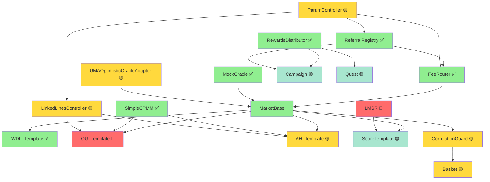

# 待实现合约清单与实施路线图

**文档版本**: v1.0
**生成日期**: 2025-11-01
**项目阶段**: Week 5-6 (Keeper服务开发中)

---

## 📊 执行摘要

**已实现合约**: 8个核心合约
**待实现合约**: 11个核心合约
**合约实现进度**: 42% (8/19)
**测试通过率**: 100% (252/252 测试通过)

---

## ✅ 已实现合约清单

### 核心基础设施（6个）

| 合约名称 | 路径 | 状态 | 测试文件 | 测试数量 |
|---------|------|------|---------|---------|
| **MarketBase** | `src/core/MarketBase.sol` | ✅ 已实现 | BaseTest + WDL_Template.t.sol | 51+ |
| **MarketTemplateRegistry** | `src/core/MarketTemplateRegistry.sol` | ✅ 已实现 | MarketTemplateRegistry.t.sol | 32 |
| **FeeRouter** | `src/core/FeeRouter.sol` | ✅ 已实现 | FeeRouter.t.sol | 29 |
| **RewardsDistributor** | `src/core/RewardsDistributor.sol` | ✅ 已实现 | RewardsDistributor.t.sol | 42 |
| **ReferralRegistry** | `src/core/ReferralRegistry.sol` | ✅ 已实现 | ReferralRegistry.t.sol | 41 |
| **SimpleCPMM** | `src/pricing/SimpleCPMM.sol` | ✅ 已实现 | SimpleCPMM.t.sol | 23 |

### 预言机（1个）

| 合约名称 | 路径 | 状态 | 测试文件 | 测试数量 |
|---------|------|------|---------|---------|
| **MockOracle** | `src/oracle/MockOracle.sol` | ✅ 已实现 | MockOracle.t.sol + OracleIntegration.t.sol | 19+9 |

### 市场模板（1个）

| 合约名称 | 路径 | 状态 | 测试文件 | 测试数量 |
|---------|------|------|---------|---------|
| **WDL_Template** | `src/templates/WDL_Template.sol` | ✅ 已实现 | WDL_Template.t.sol + MarketBase_Redeem.t.sol | 51+6 |

**已实现合约总测试数**: 252个测试（全部通过）

---

## 🔴 待实现合约清单

### 1. 定价引擎（2个）

#### 1.1 LMSR - 对数市场评分规则

**合约名称**: `LMSR.sol`
**路径**: `src/pricing/LMSR.sol`
**所属里程碑**: M3 (第9-12周)
**优先级**: 🔴 高（精确比分市场必需）
**预估工作量**: 5-7天

**功能描述**:
- 实现对数市场评分规则（Logarithmic Market Scoring Rule）
- 适用于多结果市场（如精确比分 0-0, 1-0, 1-1, 2-0...）
- 自动平衡多个结果的流动性
- 相比CPMM，对极端赔率更友好

**关键接口**:
```solidity
interface ILMSR {
    function calculateCost(
        uint256[] memory reserves,
        uint256 outcomeId,
        uint256 shares,
        uint256 b // 流动性参数
    ) external pure returns (uint256 cost);

    function calculatePrice(
        uint256[] memory reserves,
        uint256 outcomeId,
        uint256 b
    ) external pure returns (uint256 price);
}
```

**依赖关系**:
- 依赖: 无
- 被依赖: ScoreTemplate (精确比分模板)

**测试要求**:
- [ ] 单元测试 (≥20个测试用例)
- [ ] 价格曲线验证
- [ ] 极端情况测试（单一结果大额下注）
- [ ] Gas优化验证
- [ ] 不变量测试（Echidna）

**参考资料**:
- [Hanson's LMSR Paper](https://mason.gmu.edu/~rhanson/mktscore.pdf)
- Gnosis Conditional Tokens Framework

---

#### 1.2 LinkedLinesController - 联动线控制器

**合约名称**: `LinkedLinesController.sol`
**路径**: `src/pricing/LinkedLinesController.sol`
**所属里程碑**: M2 (第5-8周)
**优先级**: 🟡 中（OU多线、AH联动必需）
**预估工作量**: 4-6天

**功能描述**:
- 管理OU（大小球）多线市场的联动定价
- 管理AH（让球）多线市场的联动定价
- 确保相邻线之间的价格一致性
- 防止套利机会

**关键功能**:
- 相邻线联动系数计算 (例如：大2.5球价格应影响大2.0球价格)
- 动态调整储备量以维持价格关系
- 支持多线同时开盘

**依赖关系**:
- 依赖: SimpleCPMM
- 被依赖: OU_Template (多线), AH_Template (多线)

**测试要求**:
- [ ] 单元测试 (≥15个测试用例)
- [ ] 联动一致性验证
- [ ] 套利检测测试
- [ ] 极端价格场景测试

---

### 2. 市场模板（3个）

#### 2.1 OU_Template - 大小球市场模板

**合约名称**: `OU_Template.sol`
**路径**: `src/templates/OU_Template.sol`
**所属里程碑**: M1 (第3-4周)
**优先级**: 🔴 高（M1核心功能）
**预估工作量**: 3-5天

**功能描述**:
- 实现大小球（Over/Under）市场
- 支持单线（如仅大2.5球）和多线（0.5, 1.5, 2.5, 3.5球同时开盘）
- 使用SimpleCPMM定价（单线）或LinkedLinesController（多线）
- 支持全场、半场、单队大小球等变种

**市场参数**:
```solidity
struct OUMarketParams {
    string matchId;
    string homeTeam;
    string awayTeam;
    uint256 kickoffTime;
    uint256 line; // 盘口线（如2.5 = 2500）
    bool isMultiLine; // 是否多线市场
    uint256[] additionalLines; // 其他线（如[0.5, 1.5, 3.5]）
}
```

**依赖关系**:
- 依赖: MarketBase, SimpleCPMM, (可选) LinkedLinesController
- 被依赖: 无

**测试要求**:
- [ ] 单元测试 (≥30个测试用例)
- [ ] 完整生命周期测试
- [ ] 单线与多线场景测试
- [ ] 结算逻辑验证（进球数统计）

**实施注意事项**:
- M1阶段仅实现单线版本
- M2阶段扩展到多线联动

---

#### 2.2 AH_Template - 让球市场模板

**合约名称**: `AH_Template.sol`
**路径**: `src/templates/AH_Template.sol`
**所属里程碑**: M2 (第5-8周)
**优先级**: 🟡 中
**预估工作量**: 4-6天

**功能描述**:
- 实现让球（Asian Handicap）市场
- 支持整数盘（0, -1, +1）、半球盘（-0.5, +0.5）、平半盘（0/-0.5）
- 支持多线联动定价
- 处理复杂的退款规则（平半盘、平球盘）

**市场参数**:
```solidity
struct AHMarketParams {
    string matchId;
    string homeTeam;
    string awayTeam;
    uint256 kickoffTime;
    int256 handicap; // 让球数（-1.5 = -1500, +0.5 = 500）
    bool isAsianLine; // 是否平半盘（需要拆分下注）
}
```

**复杂度**:
- 让球盘结算逻辑复杂（需考虑实际比分 + 让球数）
- 平半盘需要拆分下注（一半下0盘，一半下-0.5盘）
- 多线联动（如-0.5, -1, -1.5, -2同时开盘）

**依赖关系**:
- 依赖: MarketBase, SimpleCPMM, LinkedLinesController
- 被依赖: 无

**测试要求**:
- [ ] 单元测试 (≥35个测试用例)
- [ ] 各种让球盘结算测试
- [ ] 退款场景测试
- [ ] 多线联动测试

---

#### 2.3 ScoreTemplate - 精确比分市场模板

**合约名称**: `ScoreTemplate.sol`
**路径**: `src/templates/ScoreTemplate.sol`
**所属里程碑**: M3 (第9-12周)
**优先级**: 🟢 低
**预估工作量**: 5-7天

**功能描述**:
- 实现精确比分市场（如0-0, 1-0, 1-1, 2-0, 0-1, 2-1...）
- 使用LMSR定价引擎（因为结果数量多，CPMM不适用）
- 支持常见比分 + "其他比分"兜底选项
- 高赔率市场（单个结果概率低）

**市场结果示例**:
```
0-0, 1-0, 0-1, 1-1, 2-0, 0-2, 2-1, 1-2, 2-2,
3-0, 0-3, 3-1, 1-3, 3-2, 2-3, 其他比分
```

**依赖关系**:
- 依赖: MarketBase, LMSR
- 被依赖: 无

**测试要求**:
- [ ] 单元测试 (≥25个测试用例)
- [ ] LMSR定价正确性验证
- [ ] 大量结果场景测试
- [ ] "其他比分"兜底逻辑测试

---

### 3. 串关系统（2个）

#### 3.1 Basket - 串关合约

**合约名称**: `Basket.sol`
**路径**: `src/parlay/Basket.sol`
**所属里程碑**: M2-M3 (第5-12周)
**优先级**: 🟡 中
**预估工作量**: 6-8天

**功能描述**:
- 实现串关（Parlay）组合下注
- 支持2-10场市场组合
- 自动计算组合赔率（各市场赔率相乘）
- 集成相关性检查（通过CorrelationGuard）
- 全中才赢，任一错误全输

**关键接口**:
```solidity
function createParlay(
    address[] calldata markets,
    uint256[] calldata outcomes,
    uint256 amount
) external returns (uint256 parlayId);

function redeemParlay(uint256 parlayId) external returns (uint256 payout);
```

**依赖关系**:
- 依赖: MarketBase (各市场合约), CorrelationGuard
- 被依赖: 无

**测试要求**:
- [ ] 单元测试 (≥30个测试用例)
- [ ] 2-10场串关场景测试
- [ ] 赔率计算验证
- [ ] 结算逻辑测试（全中、部分错、全错）
- [ ] Gas优化测试（大串关）

---

#### 3.2 CorrelationGuard - 相关性守卫

**合约名称**: `CorrelationGuard.sol`
**路径**: `src/parlay/CorrelationGuard.sol`
**所属里程碑**: M2-M3 (第5-12周)
**优先级**: 🟡 中
**预估工作量**: 4-6天

**功能描述**:
- 检测串关中的相关性（如同场WDL+OU不应组合）
- 应用相关性惩罚（降低组合赔率）或直接阻断
- 维护相关性矩阵（链下计算，链上验证）
- 支持治理更新相关性规则

**相关性规则示例**:
```
同场同向（如曼联赢+大2.5球）: 赔率折扣20%
同场反向（如曼联赢+小2.5球）: 阻断
不同场: 无惩罚
```

**依赖关系**:
- 依赖: MarketBase (获取市场信息)
- 被依赖: Basket

**测试要求**:
- [ ] 单元测试 (≥20个测试用例)
- [ ] 各种相关性场景测试
- [ ] 赔率惩罚计算验证
- [ ] 治理更新测试

---

### 4. 预言机（1个）

#### 4.1 UMAOptimisticOracleAdapter - UMA预言机适配器

**合约名称**: `UMAOptimisticOracleAdapter.sol`
**路径**: `src/oracle/UMAOptimisticOracleAdapter.sol`
**所属里程碑**: M1 (第3周)
**优先级**: 🟡 中（生产环境必需）
**预估工作量**: 4-5天

**功能描述**:
- 集成UMA Optimistic Oracle V3
- 实现乐观式结算流程：Propose → Dispute → Resolve
- 处理质押、争议、最终确认
- 标准化赛果数据结构

**工作流程**:
```
1. Keeper提交赛果 + 质押BOND
2. 争议窗口（默认2小时）
3. 如有争议 → UMA DVM仲裁
4. 无争议 → 自动确认
5. 市场Finalize，用户可赎回
```

**依赖关系**:
- 依赖: UMA Optimistic Oracle V3 (外部合约)
- 被依赖: 所有市场模板（生产环境）

**测试要求**:
- [ ] 单元测试 (≥25个测试用例)
- [ ] 完整争议流程测试
- [ ] 质押和惩罚测试
- [ ] 数据结构验证测试

**实施注意事项**:
- 当前使用MockOracle进行测试
- 生产环境切换到UMA Adapter
- 需要集成UMA的数据请求格式

---

### 5. 运营基建（3个）

#### 5.1 Campaign & Quest - 活动与任务工厂

**合约名称**: `Campaign.sol` + `Quest.sol`
**路径**: `src/campaign/Campaign.sol`, `src/campaign/Quest.sol`
**所属里程碑**: M2 (第5-8周)
**优先级**: 🟢 低
**预估工作量**: 5-7天

**功能描述**:
- **Campaign**: 活动工厂（如"世界杯推广活动"）
- **Quest**: 任务系统（如"下注≥100 USDC奖励10 USDC"）
- 支持多种任务类型：下注量、邀请数、连续下注等
- 自动发放奖励或积分

**依赖关系**:
- 依赖: MarketBase, ReferralRegistry, RewardsDistributor
- 被依赖: 无

**测试要求**:
- [ ] Campaign单元测试 (≥15个)
- [ ] Quest单元测试 (≥20个)
- [ ] 任务完成检测测试
- [ ] 奖励发放测试

---

#### 5.2 CreditToken & Coupon - 免佣券与加成券

**合约名称**: `CreditToken.sol` + `Coupon.sol`
**路径**: `src/tokens/CreditToken.sol`, `src/tokens/Coupon.sol`
**所属里程碑**: M2 (第5-8周)
**优先级**: 🟢 低
**预估工作量**: 3-5天

**功能描述**:
- **CreditToken**: 免手续费券（ERC-1155，可交易）
- **Coupon**: 赔率加成券（如+5%赔率）
- 支持过期时间、使用次数限制
- 集成到下注流程

**依赖关系**:
- 依赖: MarketBase, FeeRouter
- 被依赖: 无

**测试要求**:
- [ ] CreditToken单元测试 (≥10个)
- [ ] Coupon单元测试 (≥10个)
- [ ] 使用和过期测试

---

#### 5.3 ParamController - 参数控制器

**合约名称**: `ParamController.sol`
**路径**: `src/governance/ParamController.sol`
**所属里程碑**: M1-M2 (第3-8周)
**优先级**: 🟡 中
**预估工作量**: 4-6天

**功能描述**:
- 集中管理系统参数（费率、限额、联动系数等）
- 支持治理提案修改参数
- 集成Timelock延迟执行
- 参数变更事件通知

**管理的参数**:
- 手续费率（默认2%）
- 单笔下注限额
- 单用户/单市场敞口限额
- OU/AH联动系数
- 推荐返佣比例

**依赖关系**:
- 依赖: Safe多签 + Timelock
- 被依赖: FeeRouter, LinkedLinesController, ReferralRegistry

**测试要求**:
- [ ] 单元测试 (≥20个测试用例)
- [ ] 治理流程测试
- [ ] Timelock延迟测试
- [ ] 参数验证测试

---

## 📅 实施路线图

### 依赖关系图（Mermaid）



**图例**:
- 🟢 绿色: 已实现
- 🔴 红色: 高优先级待实现
- 🟡 黄色: 中优先级待实现
- 🟢 浅绿: 低优先级待实现

---

### 按里程碑分组

#### M1 阶段（第3-4周）- 主流程闭环 ⚠️ 部分缺失

**目标**: WDL + OU单线、AMM、结算、奖励/推荐

**已完成**:
- ✅ WDL_Template
- ✅ SimpleCPMM
- ✅ FeeRouter
- ✅ RewardsDistributor
- ✅ ReferralRegistry
- ✅ MockOracle

**待补充**:
- 🔴 OU_Template (单线版本) - 3-5天
- 🟡 UMAOptimisticOracleAdapter - 4-5天

**建议行动**: 优先完成OU_Template单线版本，完成M1核心目标

---

#### M2 阶段（第5-8周）- 运营闭环 ⏳ 进行中

**目标**: 活动/任务、周度Merkle、OU多线联动、AH

**已完成**:
- ✅ (RewardsDistributor的周度Merkle功能已实现)

**待补充**:
- 🟡 LinkedLinesController - 4-6天
- 🟡 OU_Template (多线扩展) - 2-3天
- 🟡 AH_Template - 4-6天
- 🟡 ParamController - 4-6天
- 🟡 Basket + CorrelationGuard - 10-14天
- 🟢 Campaign + Quest - 5-7天
- 🟢 CreditToken + Coupon - 3-5天

**预估总工作量**: 32-47天

---

#### M3 阶段（第9-12周）- 扩玩法

**目标**: 精确比分（LMSR）、球员道具、CLOB插槽

**待补充**:
- 🔴 LMSR - 5-7天
- 🟢 ScoreTemplate - 5-7天
- 球员道具模板 (未列入当前清单)
- CLOB插槽 (未列入当前清单)

**预估总工作量**: 10-14天 (仅已规划部分)

---

## 🎯 建议的实施顺序

### 阶段1: 完成M1核心功能（Week 6-7）

**优先级排序**:
1. **OU_Template (单线)** - 3-5天
   - 完成M1的核心玩法目标
   - 测试完整下注→结算流程

2. **UMAOptimisticOracleAdapter** - 4-5天
   - 为生产环境准备
   - 测试乐观式结算流程

**里程碑验证**: 完整运行 WDL + OU 市场的端到端流程

---

### 阶段2: 启动M2运营功能（Week 8-10）

**并行开发**:
- Track 1: **ParamController + LinkedLinesController** - 8-12天
  - 治理基础设施
  - 多线联动定价

- Track 2: **Basket + CorrelationGuard** - 10-14天
  - 串关系统
  - 相关性检测

**顺序开发**:
- **AH_Template** - 4-6天 (依赖LinkedLinesController)
- **OU_Template多线扩展** - 2-3天 (依赖LinkedLinesController)

---

### 阶段3: 运营激励系统（Week 11-12）

**低优先级功能**:
- **Campaign + Quest** - 5-7天
- **CreditToken + Coupon** - 3-5天

**里程碑验证**: 完整运营闭环（活动→任务→奖励→券）

---

### 阶段4: 高级玩法（Week 13+）

**M3目标**:
- **LMSR** - 5-7天
- **ScoreTemplate** - 5-7天
- 球员道具模板
- CLOB集成

---

## 📋 每个合约的测试要求规范

### 最小测试覆盖率要求

| 合约类型 | 行覆盖率 | 分支覆盖率 | 函数覆盖率 |
|---------|---------|-----------|-----------|
| 定价引擎 | ≥85% | ≥80% | 100% |
| 市场模板 | ≥80% | ≥75% | ≥95% |
| 串关系统 | ≥80% | ≥75% | ≥95% |
| 预言机 | ≥85% | ≥80% | 100% |
| 运营基建 | ≥75% | ≥70% | ≥90% |

### 必需的测试类型

每个合约必须包含:
1. **单元测试**: 测试每个公开/外部函数
2. **边界测试**: 零值、最大值、溢出场景
3. **权限测试**: onlyOwner、角色控制验证
4. **状态转换测试**: 生命周期各阶段验证
5. **集成测试**: 与依赖合约的交互测试
6. **Gas优化测试**: 关键操作的Gas基准

### 高风险合约额外要求

定价引擎、串关系统、预言机还需:
- **不变量测试** (Echidna): 验证核心不变量
- **模糊测试**: 随机输入测试
- **Formal Verification** (可选): 关键数学公式验证

---

## 📊 工作量汇总

### 按优先级

| 优先级 | 合约数量 | 预估总天数 |
|-------|---------|-----------|
| 🔴 高 | 3个 | 11-17天 |
| 🟡 中 | 5个 | 30-43天 |
| 🟢 低 | 3个 | 13-19天 |
| **总计** | **11个** | **54-79天** |

### 按类别

| 类别 | 合约数量 | 预估总天数 |
|------|---------|-----------|
| 定价引擎 | 2个 | 9-13天 |
| 市场模板 | 3个 | 12-18天 |
| 串关系统 | 2个 | 10-14天 |
| 预言机 | 1个 | 4-5天 |
| 运营基建 | 3个 | 12-18天 |
| **总计** | **11个** | **47-68天** |

---

## 🚨 关键风险与建议

### 风险1: M1核心功能未完成

**影响**: OU_Template缺失导致M1目标未达成

**建议**:
- 立即启动OU_Template单线开发（3-5天）
- 优先级高于当前的Keeper服务完善

---

### 风险2: 依赖链阻塞

**影响**: LinkedLinesController未完成导致AH和OU多线无法开发

**建议**:
- 提前规划LinkedLinesController接口
- AH和OU多线可先基于接口Mock开发

---

### 风险3: 测试覆盖率不足

**影响**: 当前lcov.info显示大部分合约0%覆盖率（可能是报告问题）

**建议**:
- 手动验证实际覆盖率
- 补充不变量测试（Echidna）
- 每个新合约强制≥80%覆盖率

---

## 📝 下一步行动项（本周）

### 高优先级（Week 6）

1. ✅ **修复测试失败** (已完成)
   - 所有252个测试通过

2. 🔴 **开始OU_Template开发** (3-5天)
   - 单线版本
   - 完整测试套件
   - 集成到Keeper服务

3. 🟡 **规划LinkedLinesController接口** (1天)
   - 定义标准接口
   - 供后续多线模板使用

### 中优先级（Week 7）

4. 🟡 **UMAOptimisticOracleAdapter开发** (4-5天)
   - 集成UMA OO V3
   - 完整争议流程测试

5. 🟡 **ParamController开发** (4-6天)
   - 治理基础设施
   - Timelock集成

---

## 📚 参考资源

### 设计文档
- `docs/design/02_AMM_LinkedLines.md` - 联动线设计
- `docs/design/04_Parlay_CorrelationGuard.md` - 串关设计
- `docs/design/03_ResultOracle_OO.md` - UMA预言机集成

### 外部资源
- [UMA Optimistic Oracle V3 Docs](https://docs.uma.xyz/)
- [Gnosis Conditional Tokens](https://docs.gnosis.io/conditionaltokens/)
- [Polymarket Contract Architecture](https://github.com/Polymarket)

---

**文档维护**: 每完成一个合约后更新此文档，移动到"已实现"部分

**下次更新建议**: Week 8 结束时
