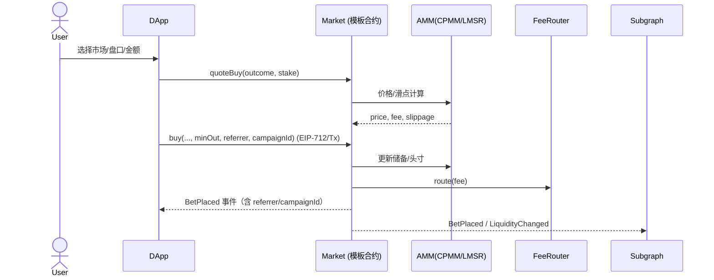
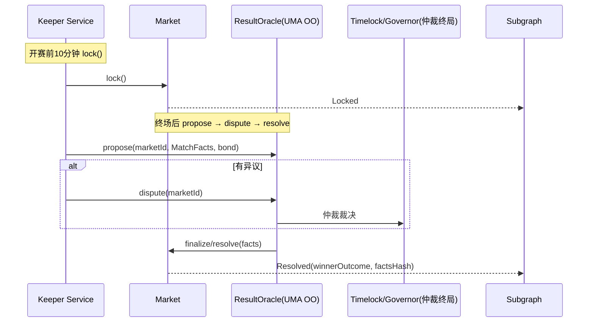
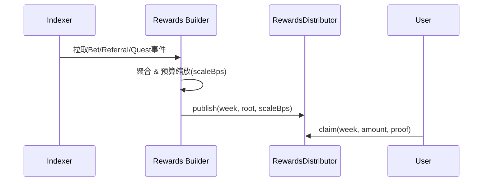
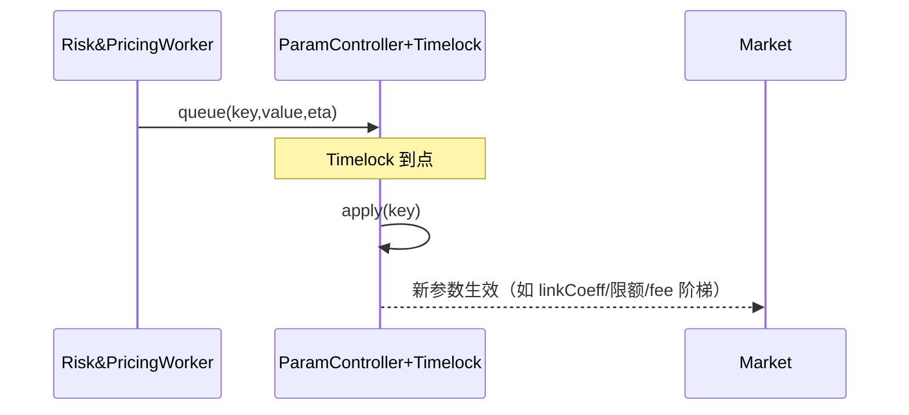

有的，而且已经成体系了。我把**总体架构图 + 关键流程时序**放在下面，能直接给到研发/运维落地。

---

# 总体架构（技术驱动）

```mermaid
flowchart LR
  subgraph Client[前端/钱包侧]
    UI[Web DApp<br/>市场浏览/下注/串关/领取]
    Wallet[钱包/EIP-712<br/>(可选4337代付)]
  end

  subgraph Onchain[链上核心]
    Factory[MarketFactory<br/>市场创建]
    Base[MarketBase (ERC-1155)<br/>WDL/OU/AH/比分 模板]
    AMM[CPMM/LMSR 做市]
    Basket[Parlay Basket<br/>+ CorrelationGuard]
    Fee[FeeRouter<br/>LP/Promo/Insurance/Treasury]
    Param[ParamController<br/>+ Timelock + Governor]
    Growth[ReferralRegistry / RewardsDistributor / CampaignFactory / Credit&Coupon / PayoutScaler]
    Oracle[ResultOracle (Optimistic)<br/>UMA OO 适配]
    Vault[Vaults (ERC-4626)]
  end

  subgraph Offchain[链下服务（Go 为主）]
    Indexer[Indexer<br/>事件→Postgres/Timescale]
    Keeper[Keeper Service<br/>锁盘/争议窗口/发布Root]
    Rewards[Rewards Builder<br/>周度Merkle聚合上链]
    Risk[Risk & Pricing Worker<br/>线联动/相关性/限额建议]
    API[只读 API Gateway]
  end

  subgraph DataObs[数据与可观测]
    Subgraph[The Graph Subgraph]
    DB[(Postgres/Timescale)]
    Graf[Grafana/Prom/OTel]
    Tenderly[Tenderly/Forta]
  end

  subgraph DevOps[DevOps & 安全]
    CI[GitHub Actions<br/>Foundry/Slither/Echidna/Tenderly]
    IaC[Terraform + Helm + K8s]
    VaultKMS[Safe 多签 / Vault-KMS]
  end

  UI --EIP-712/Tx--> Base
  UI --查询/聚合--> Subgraph
  Subgraph --索引事件--> DataObs
  Base <--结算事实--> Oracle
  Base --费用--> Fee
  Base --SFT头寸--> Wallet
  Base --LP--> Vault
  Basket --- Base
  Growth --- Base
  Param --- Base

  Indexer --> DB
  Keeper --> Oracle
  Keeper --> Base
  Rewards --> Growth
  Risk --> Param
  API --> UI
  CI --> Onchain
  CI --> Offchain
  IaC --> Offchain
  IaC --> DataObs
  VaultKMS --> CI
```

---

# 关键流程时序

## 1) 下注/做市（WDL/OU/AH 通用）



## 2) 锁盘与结果结算（乐观式）



## 3) 周度发奖（返佣/任务/活动）



## 4) 参数灰度/联动下发



---

# 部署与环境拓扑（摘要）

* **网络**：Arbitrum One（主网） + 测试网（Arb Sepolia）
* **环境**：`dev (Anvil) → testnet → staging → prod`
* **合约权限**：`Safe 多签`（资金与暂停） + `Governor+Timelock`（参数/模板/升级）
* **自动化**：Gelato/Chainlink + 自建 Keeper 冗余
* **可观测**：OTel（Go/前端埋点）+ Prom/Grafana 仪表盘 + Tenderly 回放 + Forta Agent
* **CI/CD**：Foundry 测试/覆盖率、不变量（Echidna）、静态（Slither）、仿真（Tenderly），后端镜像构建 + Helm 部署

---

## 交付对齐

* 你已经拿到：**接口/事件/参数总表（Excel）**、**Subgraph handlers 模板**、**周度计划与燃尽图**、**任务追踪文档**。
* 本回答提供：**体系化架构图**与**四条关键时序**，与前述清单一一对应。

如果你需要，我可以把这套架构转成一份**可打印 PDF 架构卡包**（组件图+时序+权限拓扑+参数字典），或者将图表内嵌到你之前的 Excel 里，方便单文件分发。

