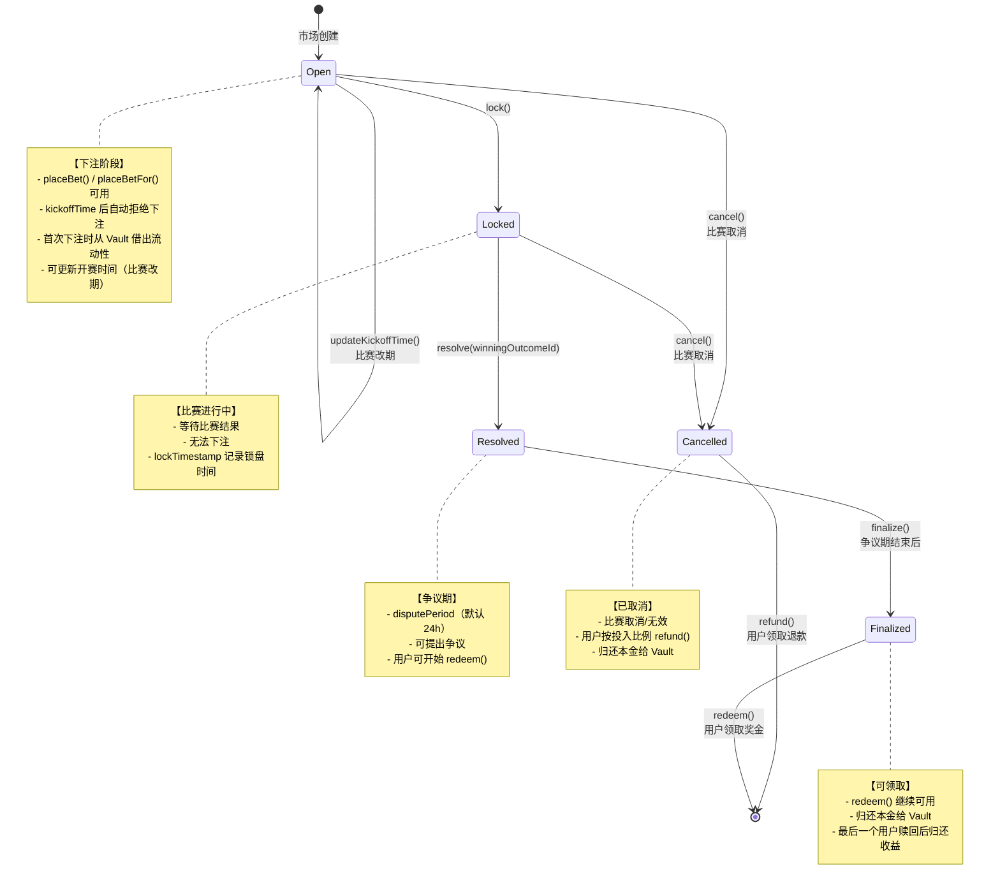
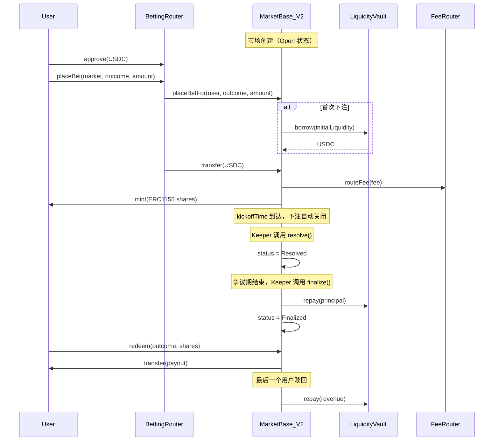

# MarketBase_V2 详细设计

## 1. 概述

- **职责**：管理市场生命周期、下注/赎回资金路径、ERC-1155 头寸发行与销毁；为各模板（WDL/OU/AH/比分/球员道具）提供统一基底。
- **外部依赖**：LiquidityVault（流动性借贷）、FeeRouter（费用分配）、FeeDiscountOracle（折扣）、ResultOracle（比赛结果）、BettingRouter（统一下注入口）。
- **边界**：资金只经 MarketBase 与 FeeRouter；流动性由 Vault 统一管理。

## 2. 状态机



### 状态转换表

| 当前状态 | 触发函数 | 目标状态 | 前置条件 | 说明 |
|---------|---------|---------|---------|------|
| - | 市场创建 | Open | - | 初始状态 |
| Open | `lock()` | Locked | onlyOwner | 比赛开始，锁定下注 |
| Open | `cancel()` | Cancelled | onlyOwner | 比赛取消（开赛前） |
| Locked | `resolve()` | Resolved | onlyOwner | 预言机上报结果 |
| Locked | `cancel()` | Cancelled | onlyOwner | 比赛取消（进行中） |
| Resolved | `finalize()` | Finalized | onlyOwner + 争议期结束 | 结果确认 |

### 异常场景处理

| 场景 | 处理方式 | 触发函数 |
|------|----------|----------|
| 比赛改期 | 更新开赛时间 | `updateKickoffTime()` |
| 比赛取消（开赛前） | Open → Cancelled | `cancel()` |
| 比赛取消（进行中） | Locked → Cancelled | `cancel()` |
| 比赛无效（已结算） | 通过 Push 机制退款 | `resolve(PUSH_OUTCOME)` |

### 时间检查机制

下注函数内置 `kickoffTime` 检查，开球时间后自动拒绝下注：

```solidity
require(kickoffTime == 0 || block.timestamp < kickoffTime, "Betting closed");
```

**注意**：时间检查仅阻止下注，不会自动改变状态。状态转换必须显式调用对应函数。

## 3. 核心存储

```solidity
// 状态
MarketStatus public status;           // Open/Locked/Resolved/Finalized
uint256 public outcomeCount;          // 结果数量（WDL=3, OU=2）
uint256 public winningOutcome;        // 获胜结果 ID

// 结算
IERC20 public settlementToken;        // 结算币种（USDC）
uint256 public feeRate;               // 手续费率（基点，200=2%）
address public feeRecipient;          // FeeRouter 地址

// 时间
uint256 public kickoffTime;           // 开球时间（自动拒绝下注）
uint256 public lockTimestamp;         // 锁盘时间（争议期起点）
uint256 public disputePeriod;         // 争议期时长（默认 24h）

// Vault 集成
ILiquidityProvider public liquidityProvider;  // Vault 接口
uint256 public borrowedAmount;                // 从 Vault 借出的金额
uint256 public totalLiquidity;                // 市场总流动性
bool public liquidityBorrowed;                // 是否已借出
bool public liquidityRepaid;                  // 是否已归还

// Router 集成
address public trustedRouter;         // BettingRouter 地址

// ERC-1155
// balanceOf(user, outcomeId) → 用户持仓份额
// totalSupply(outcomeId) → 该结果总份额
```

## 4. 接口定义

### 4.1 下注函数

```solidity
// 直接下注（需先设置 trustedRouter）
function placeBet(uint256 outcomeId, uint256 amount) external returns (uint256 shares);
function placeBetWithSlippage(uint256 outcomeId, uint256 amount, uint256 maxSlippageBps) external returns (uint256 shares);

// 代理下注（由 BettingRouter 调用）
function placeBetFor(address user, uint256 outcomeId, uint256 amount) external returns (uint256 shares);
function placeBetForWithSlippage(address user, uint256 outcomeId, uint256 amount, uint256 maxSlippageBps) external returns (uint256 shares);
```

**前置条件**：
- `status == Open`
- `kickoffTime == 0 || block.timestamp < kickoffTime`
- `trustedRouter != address(0)`（直接下注时）
- `msg.sender == trustedRouter`（代理下注时）

**执行流程**：
1. 首次下注时从 Vault 借出初始流动性
2. 计算手续费（考虑折扣）
3. 调用子合约 `_calculateShares()` 定价
4. 滑点检查
5. 转账 USDC 到市场合约
6. 路由手续费到 FeeRouter
7. Mint ERC-1155 position token

### 4.2 状态转换函数

```solidity
// 锁盘（比赛开始）
function lock() external;

// 结算（预言机上报结果）
function resolve(uint256 winningOutcomeId) external;

// 终结（争议期结束后）
function finalize() external;

// 取消（比赛取消/无效）
function cancel(string calldata reason) external;
```

### 4.3 赎回/退款函数

```solidity
// 赎回奖金（Resolved/Finalized 状态）
function redeem(uint256 outcomeId, uint256 shares) external returns (uint256 payout);

// 退款（Cancelled 状态）
function refund(uint256 outcomeId, uint256 shares) external returns (uint256 amount);
```

**redeem() 前置条件**：
- `status == Resolved || status == Finalized`
- 持有足够的 shares
- 仅获胜 outcome 可赎回（Push 除外）

**refund() 前置条件**：
- `status == Cancelled`
- 持有足够的 shares

**赔付/退款计算**：
- **常规赔付**：`payout = shares * distributableLiquidity / totalWinningShares`
- **Push 退款**：`payout = shares * distributableLiquidity / totalAllShares`
- **取消退款**：`amount = shares * distributableLiquidity / totalAllShares`

### 4.4 查询函数

```solidity
function getUserPosition(address user, uint256 outcomeId) external view returns (uint256);
function calculateFee(address user, uint256 amount) public view returns (uint256 fee);
function getTimeUntilKickoff() external view returns (uint256 timeUntilKickoff, bool canBet);
function isLocked() external view returns (bool);  // 基于时间判断
```

## 5. 事件契约

```solidity
// 核心事件
event BetPlaced(address indexed user, uint256 indexed outcomeId, uint256 amount, uint256 shares, uint256 fee);
event Locked(uint256 timestamp);
event Resolved(uint256 indexed winningOutcome, uint256 timestamp);
event Finalized(uint256 timestamp);
event Cancelled(string reason, uint256 timestamp);
event Redeemed(address indexed user, uint256 indexed outcomeId, uint256 shares, uint256 payout);
event Refunded(address indexed user, uint256 indexed outcomeId, uint256 shares, uint256 amount);

// Vault 集成
event LiquidityBorrowed(uint256 amount, uint256 timestamp);
event BorrowFailed(uint256 requestedAmount, string reason);
event LiquidityRepaid(uint256 principal, uint256 revenue, uint256 timestamp);

// 管理事件
event KickoffTimeUpdated(uint256 oldKickoffTime, uint256 newKickoffTime, uint256 timestamp);
event TrustedRouterUpdated(address indexed oldRouter, address indexed newRouter);
event FeeRateUpdated(uint256 oldRate, uint256 newRate);
event FeeRecipientUpdated(address indexed oldRecipient, address indexed newRecipient);
event DiscountOracleUpdated(address indexed oldOracle, address indexed newOracle);
event ResultOracleUpdated(address indexed newOracle);

// 紧急
event EmergencyUserWithdrawal(address indexed user, uint256 indexed outcomeId, uint256 shares, uint256 amount, address indexed admin);
```

## 6. 资金流



## 7. 不变量与安全

### 守恒检查
- `totalLiquidity = borrowedAmount + Σ(userBets) - Σ(fees)`
- `Σ(totalSupply(outcomeId)) = Σ(userShares)`

### 安全措施
- **重入保护**：所有写入函数使用 `nonReentrant`
- **CEI 模式**：先更新状态，后转账
- **权限控制**：`onlyOwner` 保护管理函数
- **暂停机制**：`whenNotPaused` 保护下注函数
- **滑点保护**：`maxSlippageBps` 参数

### Push 退款
当 `winningOutcome == 2 && outcomeCount >= 3` 时触发 Push 退款机制：
- 所有用户按持仓比例退款
- 不区分 outcomeId，按 `shares / totalAllShares` 比例分配

## 8. 子合约必须实现

```solidity
// 定价函数（AMM 计算）
function _calculateShares(uint256 outcomeId, uint256 netAmount) internal virtual returns (uint256 shares);

// 初始借款金额（CPMM 模式返回具体值，Parimutuel 模式返回 0）
function _getInitialBorrowAmount() internal view virtual returns (uint256);
```

## 9. 管理函数

```solidity
function setDiscountOracle(address _discountOracle) external onlyOwner;
function setResultOracle(address _resultOracle) external onlyOwner;
function setFeeRate(uint256 _feeRate) external onlyOwner;        // 最大 10%
function setFeeRecipient(address _feeRecipient) external onlyOwner;
function setTrustedRouter(address _router) external onlyOwner;
function updateKickoffTime(uint256 newKickoffTime) external onlyOwner;
function pause() external onlyOwner;
function unpause() external onlyOwner;
function emergencyWithdrawUser(address user, uint256 outcomeId, uint256 shares) external onlyOwner;
```

## 10. 测试计划

### 单元测试
- 下注：正常下注、滑点保护、时间检查、Router 代理下注
- 状态转换：lock/resolve/finalize 各状态前置条件
- 赎回：常规赔付、Push 退款、余额不足
- Vault 集成：借款成功/失败降级、归还本金/收益

### 不变量测试（Echidna）
- 随机 bet/redeem/lock/resolve 序列下资金守恒
- 赢家唯一性（常规场景）
- Push 退款总额等于 totalLiquidity

### 集成测试
- 完整流程：创建市场 → 下注 → 锁盘 → 结算 → 赎回
- 多用户并发下注/赎回
- FeeRouter 费用分配验证

## 11. 运维要点

### Keeper 任务
1. **结算**：监听预言机结果 → 调用 `resolve(winningOutcomeId)`
2. **终结**：争议期结束后 → 调用 `finalize()`

**注意**：`lock()` 调用已变为可选，下注由 `kickoffTime` 自动阻止。

### 监控指标
- `BetPlaced` 事件速率
- `Resolved`/`Finalized` 延迟
- Vault 借款/还款状态
- 失败交易（Gas 异常、余额不足）

### 紧急处理
- `pause()` 暂停下注
- `emergencyWithdrawUser()` 紧急提款
- 预言机失败时的手动 `resolve()` 流程
