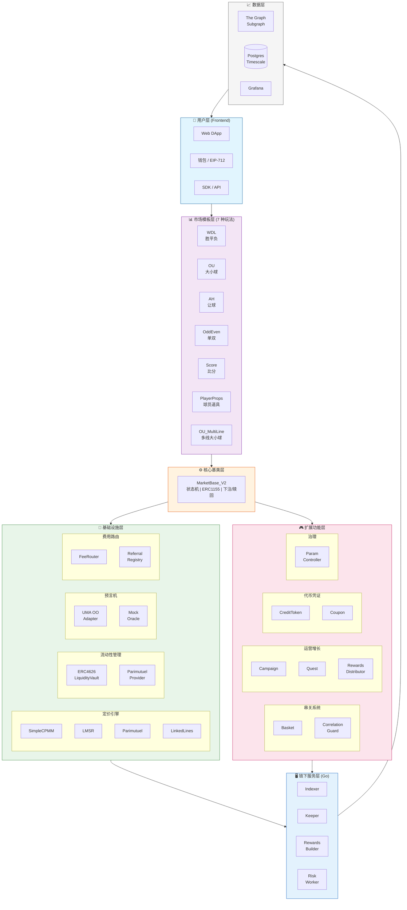
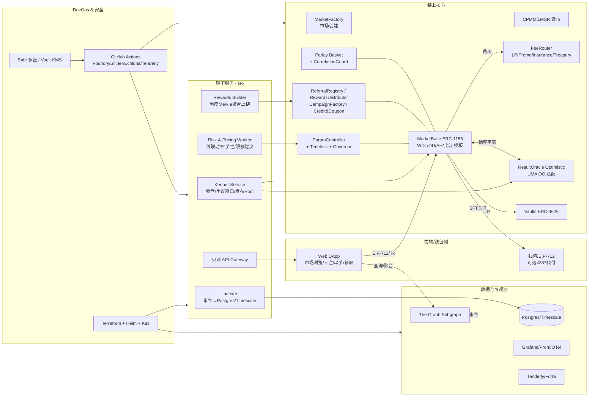
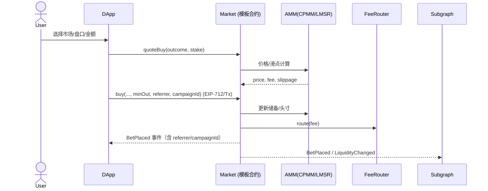
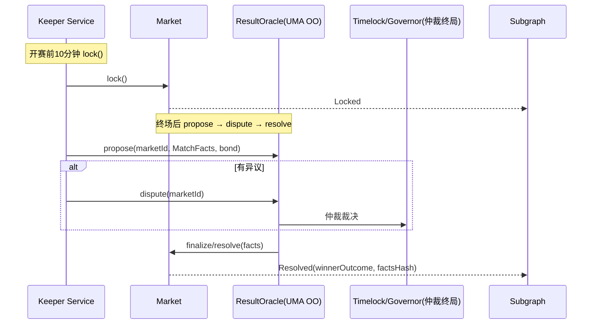
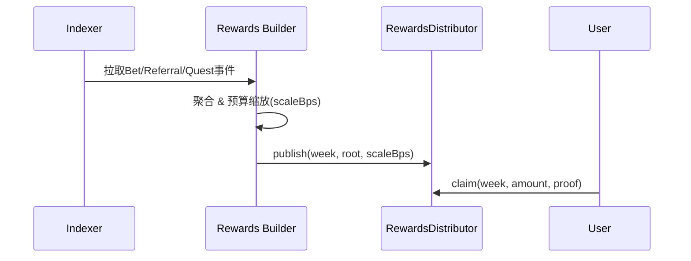
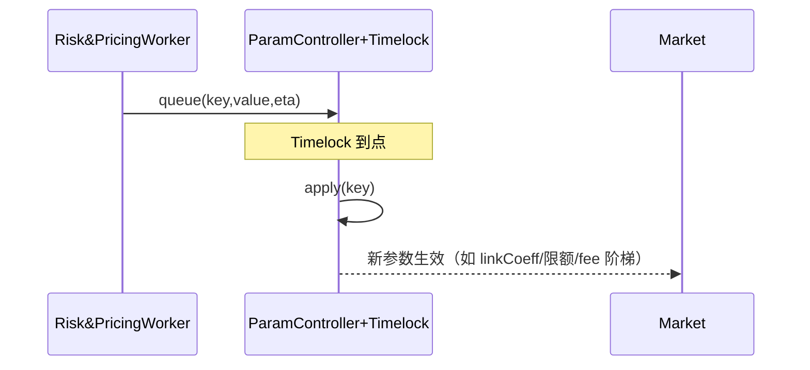

# PitchOne 合约架构设计文档

> 最后更新：2025-12-06

本文档详细描述 PitchOne 去中心化博彩平台的合约架构、模块关系和核心调用逻辑。

---

## 目录

1. [整体架构分层](#1-整体架构分层)
2. [合约模块概览](#2-合约模块概览)
3. [核心继承关系](#3-核心继承关系)
4. [关键调用流程](#4-关键调用流程)
5. [模块依赖矩阵](#5-模块依赖矩阵)
6. [定价引擎选择](#6-定价引擎选择)
7. [设计模式应用](#7-设计模式应用)
8. [关键流程时序图](#8-关键流程时序图)
9. [部署与环境拓扑](#9-部署与环境拓扑)

---

## 1. 整体架构分层

```
┌─────────────────────────────────────────────────────────────────┐
│                         用户层 (Frontend)                        │
│              Web DApp / 钱包 / EIP-712 签名                       │
└───────────────────────────────┬─────────────────────────────────┘
                                │
┌───────────────────────────────▼─────────────────────────────────┐
│                      市场模板层 (7 种玩法)                         │
│  WDL │ OU │ AH │ OddEven │ Score │ PlayerProps │ OU_MultiLine   │
└───────────────────────────────┬─────────────────────────────────┘
                                │ 继承
┌───────────────────────────────▼─────────────────────────────────┐
│                     MarketBase_V2 (核心基类)                      │
│     状态机 │ ERC1155头寸 │ 下注/赎回 │ 费用扣除 │ Vault集成        │
└──────┬────────────┬────────────┬────────────┬───────────────────┘
       │            │            │            │
       ▼            ▼            ▼            ▼
┌──────────┐ ┌───────────┐ ┌──────────┐ ┌─────────────┐
│ Pricing  │ │  Oracle   │ │ FeeRouter│ │ LiquidityVault│
│ Engine   │ │           │ │          │ │  (ERC4626)    │
└──────────┘ └───────────┘ └──────────┘ └─────────────┘
```

### Mermaid 分层架构图



### Mermaid 系统拓扑图



---

## 2. 合约模块概览

**总计 44 个 Solidity 文件**，分类如下：

| 类别 | 数量 | 主要文件 |
|------|------|---------|
| 核心模块 | 7 | MarketBase_V2, Factory, FeeRouter 等 |
| 市场模板 | 7 | 7 种玩法 (V2 版本) |
| 定价引擎 | 5 | SimpleCPMM, LMSR, Parimutuel, LinkedLinesController |
| 流动性管理 | 4 | LiquidityVault, ERC4626LP, ParimutuelLP, Factory |
| 串关系统 | 2 | Basket, CorrelationGuard |
| 预言机 | 2 | MockOracle, UMAOptimisticOracleAdapter |
| 运营工具 | 4 | Campaign, Quest, PayoutScaler, RewardsDistributor |
| 治理 | 1 | ParamController |
| 代币凭证 | 2 | CreditToken, Coupon |
| 接口定义 | 13 | IMarket, IPricingEngine, IResultOracle 等 |
| 库/工具 | 1 | ScoreMarketLib |

### 目录结构

```
contracts/src/
├── core/                       # 核心基础设施
│   ├── MarketBase_V2.sol       # 市场基类（生产版）
│   ├── MarketFactory_v2.sol    # Clone 工厂
│   ├── MarketTemplateRegistry.sol # 模板注册表
│   ├── FeeRouter.sol           # 费用路由分配
│   ├── RewardsDistributor.sol  # Merkle 奖励分发
│   └── ReferralRegistry.sol    # 推荐关系管理
│
├── templates/                  # 7 种市场模板 (V2)
│   ├── WDL_Template_V2.sol     # 胜平负
│   ├── OU_Template_V2.sol      # 大小球单线
│   ├── OU_MultiLine_V2.sol     # 大小球多线
│   ├── AH_Template_V2.sol      # 让球
│   ├── OddEven_Template_V2.sol # 单双
│   ├── ScoreTemplate_V2.sol    # 精确比分
│   └── PlayerProps_Template_V2.sol # 球员道具
│
├── pricing/                    # 定价引擎
│   ├── SimpleCPMM.sol          # 虚拟储备 AMM
│   ├── LMSR.sol                # 对数市场评分规则
│   ├── LMSR_Optimized.sol      # LMSR 优化版
│   ├── LinkedLinesController.sol    # 多线联动控制
│   ├── LinkedLinesController_Optimized.sol
│   └── ParimutuelPricing.sol   # 彩池定价
│
├── liquidity/                  # 流动性管理
│   ├── LiquidityVault.sol      # ERC4626 金库
│   ├── ERC4626LiquidityProvider.sol
│   ├── ParimutuelLiquidityProvider.sol
│   └── LiquidityProviderFactory.sol
│
├── parlay/                     # 串关系统
│   ├── Basket.sol              # 串关组合合约
│   └── CorrelationGuard.sol    # 相关性守卫
│
├── oracle/                     # 预言机
│   ├── MockOracle.sol          # 测试预言机
│   └── UMAOptimisticOracleAdapter.sol # UMA OO 适配器
│
├── growth/                     # 运营工具
│   ├── Campaign.sol            # 活动工厂
│   ├── Quest.sol               # 任务系统
│   └── PayoutScaler.sol        # 预算缩放
│
├── governance/                 # 治理
│   └── ParamController.sol     # 参数控制器
│
├── tokens/                     # 代币凭证
│   ├── CreditToken.sol         # 免佣券
│   └── Coupon.sol              # 赔率加成券
│
├── interfaces/                 # 接口定义（13个）
│   ├── IMarket.sol
│   ├── IPricingEngine.sol
│   ├── IResultOracle.sol
│   ├── ILiquidityProvider.sol
│   ├── IBasket.sol
│   ├── ICorrelationGuard.sol
│   └── ...
│
└── libraries/                  # 工具库
    └── ScoreMarketLib.sol
```

---

## 3. 核心继承关系

### 3.1 市场基础类继承树

```
IMarket (接口)
    │
    └─ MarketBase_V2 (生产版 - 集成 LiquidityVault)
        ├─ WDL_Template_V2      # 胜平负
        ├─ OU_Template_V2       # 大小球单线
        ├─ AH_Template_V2       # 让球 (+ IAH_Template 接口)
        ├─ OddEven_Template_V2  # 单双
        ├─ ScoreTemplate_V2     # 精确比分
        ├─ PlayerProps_Template_V2  # 球员道具
        └─ OU_MultiLine_V2      # 多线大小球
```

**V2 架构特点：**
- 外部 Vault 集成，市场从 LiquidityVault 借出初始流动性
- 结算后归还本金+收益给 LP
- Clone 模式部署，节省 Gas

### 3.2 定价引擎继承树

```
IPricingEngine (接口)
    │
    ├─ SimpleCPMM          # 虚拟储备 CPMM（用于 WDL/OU/AH/OddEven）
    ├─ LMSR                # 对数市场评分规则（用于 Score/PlayerProps）
    ├─ LMSR_Optimized      # 性能优化版
    └─ ParimutuelPricing   # 彩池模式定价

LinkedLinesController      # 多线联动控制器（用于 OU_MultiLine）
```

### 3.3 流动性管理体系

```
LiquidityVault (ERC4626)
    │
    ├─ 核心职责：LP 存入 USDC，获得 Vault Shares
    ├─ 借贷管理：市场可 borrow/repay
    └─ 限制条件：
        ├─ 最大利用率 90%
        ├─ 单市场最大借款 50% of totalAssets
        └─ 每笔借款都有 borrowed 记录

ILiquidityProvider (接口)
    │
    ├─ ERC4626LiquidityProvider (实现)
    ├─ ParimutuelLiquidityProvider (彩池模式)
    └─ MockLiquidityProvider (测试)
```

### 3.4 串关系统

```
ICorrelationGuard (接口)
    └─ CorrelationGuard (+ Ownable, AccessControl)
        └─ 由 Basket 调用检查相关性
        └─ 三种策略：ALLOW_ALL / PENALTY / STRICT_BLOCK

IBasket (接口)
    └─ Basket (+ Ownable, IERC1155Receiver)
        ├─ 支持 2-10 腿组合
        ├─ 池化资金模式
        └─ 集成相关性守卫
```

### 3.5 预言机体系

```
IResultOracle (接口)
    │
    ├─ MockOracle (测试预言机)
    └─ UMAOptimisticOracleAdapter
        └─ 适配 UMA Optimistic Oracle V3
        └─ 流程：Propose → Liveness → Settle → Finalize
```

### 3.6 运营和治理

```
Campaign (活动工厂)
    └─ 关联 Quest (任务系统)

Quest (任务)
    ├─ 5 种任务类型：下注/推荐/串关/连续登录/社交
    └─ 权限控制：ADMIN_ROLE, OPERATOR_ROLE

ParamController (参数治理)
    ├─ Timelock 机制
    ├─ 参数验证器
    └─ 紧急暂停功能

FeeRouter (费用路由)
    ├─ 分配到：LP (70%), Promo (10%), Insurance (10%), Treasury (10%)
    └─ 集成 ReferralRegistry 推荐返佣

RewardsDistributor (周度 Merkle 奖励)
```

---

## 4. 关键调用流程

### 4.1 下注流程

```
用户 → Market.placeBet(outcome, amount)
         │
         ├─→ IPricingEngine.calculateShares()   // 计算份额
         ├─→ IERC20.transferFrom(user, market)  // 收取本金
         ├─→ _mint(user, tokenId, shares)       // 铸造 ERC1155
         └─→ FeeRouter.routeFee(feeAmount)      // 费用分配
                    │
                    ├─→ ReferralRegistry.getReferrer() // 查推荐人
                    └─→ 分配到 LP/Promo/Insurance/Treasury
```

### 4.2 流动性借贷 (V2)

```
MarketFactory.createMarket()
         │
         └─→ LiquidityVault.borrow(initialLiquidity)
                    │
                    ├─→ 检查利用率 ≤ 90%
                    ├─→ borrowed[market] += amount
                    └─→ USDC.transfer(market, amount)

Market.resolve() 结算时
         │
         └─→ LiquidityVault.repay(principal, revenue)
                    │
                    ├─→ borrowed[market] -= principal
                    └─→ 收益分配给 LP shareholders
```

### 4.3 预言机结算

```
Keeper → UMAAdapter.proposeResult(matchFacts)
                │
                ├─→ UMA OO V3.assertTruth(claim, bond)
                └─→ 进入 2h 争议窗口
                         │
                         ▼ (无争议)
         Market.resolve(winningOutcome)
                │
                ├─→ status = Resolved
                └─→ 用户可 redeem()
```

### 4.4 串关组合

```
用户 → Basket.createParlay([markets], [outcomes], stake)
         │
         ├─→ CorrelationGuard.checkBlocked()    // 相关性检查
         │        │
         │        └─→ 同场同向 → PENALTY 或 BLOCK
         │
         ├─→ 计算组合赔率 = ∏(单场赔率) × 折扣
         └─→ USDC.transferFrom(user, basket)

所有市场结算后 → Basket.redeem(parlayId)
         │
         ├─→ 全中 → 发放 stake × combinedOdds
         └─→ 任一错 → 本金留在池中
```

---

## 5. 模块依赖矩阵

### 5.1 合约间依赖

| 模块 | 依赖 | 被依赖 |
|------|------|--------|
| **MarketBase_V2** | Pricing, Vault, Oracle, FeeRouter | 所有模板 |
| **SimpleCPMM** | - | WDL, OU, AH, OddEven, OU_MultiLine |
| **LMSR** | - | Score, PlayerProps |
| **LiquidityVault** | USDC | Market, Factory |
| **FeeRouter** | ReferralRegistry | Market |
| **Basket** | CorrelationGuard, Market | - |
| **UMAAdapter** | UMA OO V3 | Market |

### 5.2 模板功能矩阵

| 模板 | Vault | Pricing | Oracle | Basket | Event |
|------|:-----:|:-------:|:------:|:------:|:-----:|
| WDL_V2 | ✓ | CPMM | ✓ | ✓ | ✓ |
| OU_V2 | ✓ | CPMM | ✓ | ✓ | ✓ |
| OU_MultiLine_V2 | ✓ | CPMM+LinkedLines | ✓ | ✓ | ✓ |
| AH_V2 | ✓ | CPMM | ✓ | ✓ | ✓ |
| OddEven_V2 | ✓ | CPMM | ✓ | ✓ | ✓ |
| ScoreTemplate_V2 | ✓ | LMSR | ✓ | ✓ | ✓ |
| PlayerProps_V2 | ✓ | LMSR | ✓ | ✓ | ✓ |

---

## 6. 定价引擎选择

| 市场类型 | 定价引擎 | 结果数 | 特点 |
|---------|---------|--------|------|
| **WDL** (胜平负) | SimpleCPMM | 3 | 虚拟储备 AMM，三向市场 |
| **OU** (大小球) | SimpleCPMM | 2 | 二向市场，含 Push 退款 |
| **AH** (让球) | SimpleCPMM | 2/3 | 半球盘二向，整球盘三向 |
| **OddEven** (单双) | SimpleCPMM | 2 | 二向市场，奇偶判断 |
| **OU_MultiLine** | SimpleCPMM + LinkedLines | 多线 | 相邻线联动定价 |
| **Score** (比分) | LMSR | 25-100 | 多结果对数定价 |
| **PlayerProps** | LMSR | 多向 | 球员道具，支持多种 prop 类型 |

### 定价引擎对比

| 特性 | SimpleCPMM | LMSR | Parimutuel |
|------|-----------|------|------------|
| 结果数 | 2-3 | 3-100+ | 不限 |
| 初始流动性 | 需要 | 需要 | 不需要 |
| 赔率计算 | 实时 | 实时 | 结算时 |
| 滑点 | 有 | 有 | 无 |
| 适用场景 | WDL/OU/AH | 比分/首球者 | 传统彩池 |

---

## 7. 设计模式应用

### 7.1 策略模式 (Strategy Pattern)
- **应用**：`IPricingEngine` 接口支持多种定价策略
- **实现**：SimpleCPMM、LMSR、ParimutuelPricing 实现同一接口

### 7.2 工厂模式 (Factory Pattern)
- **应用**：`MarketFactory_v3` 使用 Clone 创建市场实例
- **优势**：降低部署 Gas（-69%），统一市场管理

### 7.3 适配器模式 (Adapter Pattern)
- **应用**：`UMAOptimisticOracleAdapter` 适配 UMA OO V3
- **作用**：屏蔽外部预言机实现细节

### 7.4 守卫模式 (Guard Pattern)
- **应用**：`CorrelationGuard` 串关相关性检查
- **应用**：`ParamController` 参数验证

### 7.5 代理模式 (Proxy Pattern)
- **应用**：可升级合约基础设施
- **实现**：Clone proxy 用于市场实例化

---

## 8. 关键流程时序图

### 8.1 下注/做市流程



### 8.2 锁盘与结果结算



### 8.3 周度发奖流程



### 8.4 参数灰度下发



---

## 9. 部署与环境拓扑

### 9.1 网络与环境

| 环境 | 网络 | 用途 |
|------|------|------|
| dev | Anvil (本地) | 开发测试 |
| testnet | Arbitrum Sepolia | 集成测试 |
| staging | Arbitrum Sepolia | 预发布验证 |
| prod | Arbitrum One | 生产环境 |

### 9.2 权限体系

- **资金操作**：Safe 多签（暂停、紧急提款）
- **参数调整**：Governor + Timelock（费率、限额、模板）
- **日常运维**：Keeper Service（锁盘、结算、奖励发布）

### 9.3 自动化

- **主要**：自建 Keeper Service（Go）
- **冗余**：Gelato / Chainlink Automation

### 9.4 可观测性

- **链上**：Tenderly 回放、Forta Agent 监控
- **链下**：OTel 埋点、Prometheus + Grafana 仪表盘
- **数据**：The Graph Subgraph、Postgres/Timescale

### 9.5 CI/CD

- **合约测试**：Foundry test + coverage
- **静态分析**：Slither
- **不变量测试**：Echidna
- **仿真**：Tenderly
- **部署**：Foundry script + Safe 多签

---

## 附录：版本演进

| 版本 | 特性 | 状态 |
|------|------|------|
| V1 | 内部 LP，市场耦合 | 已删除 (2025-12-06) |
| V2 | 外部 Vault，清晰资金流，Clone 部署 | 当前生产版 ✓ |

---

## 相关文档

- [MarketBase 设计](./01_MarketBase.md)
- [AMM 与联动定价](./02_AMM_LinkedLines.md)
- [预言机集成](./03_ResultOracle_OO.md)
- [串关与相关性](./04_Parlay_CorrelationGuard.md)
- [费用与金库](./05_FeeRouter_Vault.md)
- [奖励与推荐](./06_Rewards_Referral_Campaign.md)
- [参数治理](./07_ParamController_Governance.md)
- [市场类型总览](./MARKET_TYPES_OVERVIEW.md)
