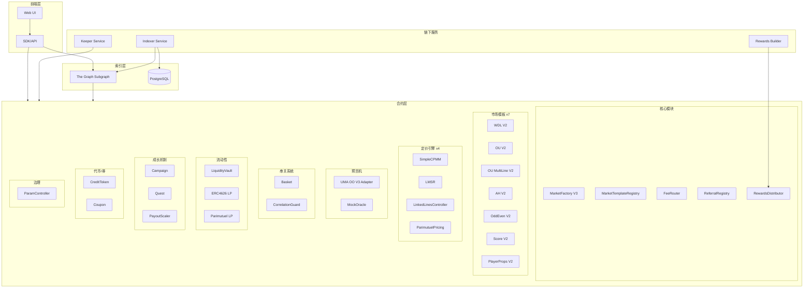
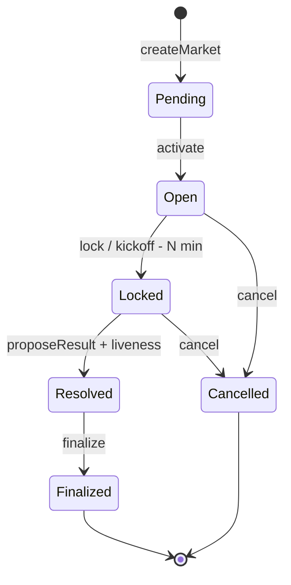
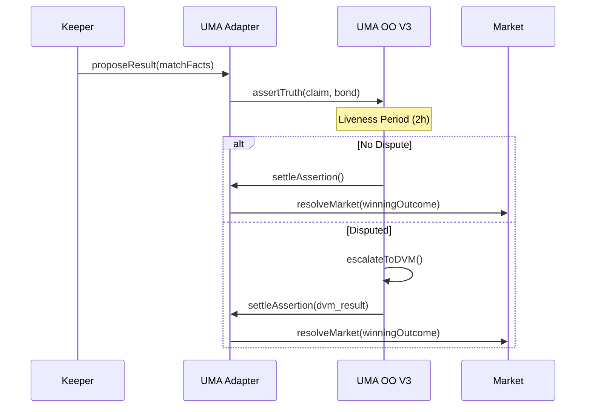
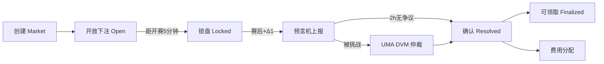

# PitchOne 架构设计蓝图

> **文档版本**：v2.0（2025-12）
> **状态**：已实现（合约开发 100% 完成）

本文档描述 PitchOne 去中心化链上足球博彩平台的架构设计与实现。核心目标：**全链上结算、可组合 AMM、去中心化预言机 + 争议仲裁、资金与风控自动化、可扩展与低成本结算**。

---

# 一、核心目标与原则

* **全流程上链**：市场创建、下注、流动性提供、赔率形成、赛果上报/仲裁、清算/赔付，全部通过智能合约完成。
* **最小信任与最小人工**：依赖 UMA Optimistic Oracle V3 与乐观式争议机制，避免中心化裁判。
* **可组合**：Outcome 头寸用 ERC-1155 表示，LP 份额用 ERC-4626 表示，可在 DEX/AMM 交易、可抵押、可打包串关。
* **可扩展与低 gas**：Clone 部署模式、批量结算、Merkle 证明提款、L2 优先部署、异步 Keeper 自动执行。
* **清晰规则**：延赛/腰斩/加时/点球等边界情况写入规则合约，避免"人治"。
* **模板化扩展**：通过 `IMarketTemplate` 接口标准化，支持热插拔新玩法。

---

# 二、系统架构总览

## 2.1 分层架构图



## 2.2 合约统计

| 分类 | 数量 | 核心合约 |
|------|------|--------|
| 核心业务 | 7 | MarketBase_V2, MarketFactory_v3, FeeRouter, ReferralRegistry, RewardsDistributor, MarketTemplateRegistry |
| 市场模板 | 7 | WDL, OU, OU_MultiLine, AH, OddEven, Score, PlayerProps（全部 V2） |
| 定价引擎 | 4 | SimpleCPMM, LMSR, LinkedLinesController, ParimutuelPricing |
| 预言机 | 2 | UMAOptimisticOracleAdapter, MockOracle |
| 串关 | 2 | Basket, CorrelationGuard |
| 流动性 | 4 | LiquidityVault, ERC4626LiquidityProvider, ParimutuelLiquidityProvider, LiquidityProviderFactory |
| 成长机制 | 3 | Campaign, Quest, PayoutScaler |
| 代币/券 | 2 | CreditToken, Coupon |
| 治理 | 1 | ParamController |
| 接口 | 13 | IMarket, IPricingEngine, IResultOracle 等 |
| **总计** | **49** | **~17,000 行代码** |

---

# 三、关键合约与组件

## 3.1 核心模块（Core）

### MarketTemplateRegistry（模板注册表）

* 管理 7 种市场模板的注册、激活、禁用
* 模板版本控制，支持热插拔新玩法
* 由治理（ParamController）控制模板白名单

### MarketFactory_v3（市场工厂）

* `createMarket(templateId, initData)` 按模板创建单场比赛市场
* **Clone 模式部署**：使用 OpenZeppelin Clones 库，节省 ~69% gas
* 记录开赛时间、锁仓时间、规则版本、数据源标识等元数据
* **重要**：所有市场必须通过 Factory 创建，Subgraph 依赖 `MarketCreated` 事件进行索引

### MarketBase_V2（市场基类，ERC-1155 头寸）

* 继承 `ERC1155SupplyUpgradeable`，每个 Outcome 对应一个 tokenId
* 市场状态机：`Pending → Open → Locked → Resolved → Finalized / Cancelled`
* 集成 LiquidityVault 借款机制：市场从 Vault 借出初始流动性
* **下注方式**：
  * **AMM 型**：调用定价引擎计算份额，用户用 USDC 买入 Outcome Token
  * **LP 提供流动性**：通过 Vault 存入，赚取交易费与隐含赔率差
* **结算**：收到 Oracle 结果后，标记胜出 Outcome，用户调用 `redeem()` 兑付

### FeeRouter（费用路由）

* 交易费分配：LP 份额 / Promo 基金 / 保险基金 / 协议金库
* 支持动态费率配置
* 与 ReferralRegistry 集成，计算推荐返佣

### ReferralRegistry（推荐注册表）

* 管理推荐关系（推荐人 ↔ 被推荐人）
* 返佣计算与追踪
* 支持多级推荐（可配置）

### RewardsDistributor（奖励分发器）

* **Merkle 树分发**：周度聚合所有待发放奖励
* 奖励类型：推荐返佣、任务奖励、活动奖金
* 用户凭 Merkle Proof 调用 `claim()` 领取

## 3.2 市场模板（Templates）

所有模板特性：
- 继承 `MarketBase_V2`
- 使用 Clone 部署模式（`initialize()` 替代 `constructor()`）
- 集成 SimpleCPMM 或 LMSR 定价引擎
- ERC-1155 Outcome Token

| 模板 | 玩法 | Outcome 数 | 定价引擎 | 特殊机制 |
|------|------|-----------|---------|---------|
| **WDL_Template_V2** | 胜平负 | 3 | SimpleCPMM | 基础三向市场 |
| **OU_Template_V2** | 大小球单线 | 2 | SimpleCPMM | Push 退款（整数盘口线） |
| **OU_MultiLine_V2** | 大小球多线 | 2n | SimpleCPMM + LinkedLines | 多条盘口线联动定价，套利检测 |
| **AH_Template_V2** | 让球 | 2-3 | SimpleCPMM | 半球盘（2向）/ 整球盘（3向含 Push） |
| **OddEven_Template_V2** | 单双 | 2 | SimpleCPMM | 判断总进球数奇偶性 |
| **ScoreTemplate_V2** | 精确比分 | 25-100 | LMSR | Outcome ID = homeGoals × 10 + awayGoals |
| **PlayerProps_Template_V2** | 球员道具 | 2-100 | SimpleCPMM / LMSR | 7 种道具类型 |

### Outcome ID 编码规则

```
WDL:        0=Win, 1=Draw, 2=Loss
OU:         0=Over, 1=Under
AH:         0=Home Covers, 1=Away Covers [, 2=Push]
OddEven:    0=Odd, 1=Even
Score:      homeGoals * 10 + awayGoals (例: 2-1=21, 0-0=0), 999=Other
OU_Multi:   lineIndex * 2 + direction (direction: 0=Over, 1=Under)
PlayerProps: 根据道具类型编码
```

## 3.3 定价引擎（Pricing）

### SimpleCPMM（虚拟恒定乘积）

* **适用**：二/三向市场（WDL、OU、AH、OddEven）
* **原理**：虚拟储备模型，`k = r₀ × r₁ [× r₂]` 常数
* **优势**：实现简单、gas 低、精度支持任意小数位
* **风控**：最大单笔滑点限制、动态费率

### LMSR（对数市场评分规则）

* **适用**：多结果市场（Score、PlayerProps 首位进球者）
* **原理**：`C(q) = b × ln(Σ exp(q_i/b))`，支持 2-100 个结果
* **优势**：保证流动性、可微定价、天然支持多路定价
* **参数**：流动性参数 `b` 影响价格敏感度

### LinkedLinesController（多线联动控制器）

* **适用**：OU_MultiLine 多线大小球市场
* **功能**：
  * 线组管理（如 2.0、2.5、3.0 球三条线）
  * 联动系数配置
  * 套利检测与阻断
  * 储备量自动调整

### ParimutuelPricing（彩池定价）

* **适用**：传统彩票模式
* **原理**：所有投注进入池子，1:1 兑换份额
* **赔率计算**：结算时 `payout = (总池子 / 胜方池子) × 用户份额`
* **优势**：不需要初始流动性

## 3.4 预言机层（Oracle）

### UMAOptimisticOracleAdapter

* 集成 **UMA Optimistic Oracle V3**
* **乐观式流程**：
  1. Proposer 提交 `MatchFacts` 结构化赛果（比分、加时、点球等），质押 BOND
  2. 进入争议窗口（默认 2 小时）
  3. 无人挑战 → 自动确认；有人挑战 → UMA DVM 仲裁
* **惩罚/激励**：错误上报没收押金，正确方获得奖励

### MockOracle

* 测试用预言机，支持本地开发和单元测试
* 直接设置结果，无争议窗口

## 3.5 串关系统（Parlay）

### Basket（串关合约）

* **池化资金模式**：本金锁定在 Basket 合约，不分散到各市场
* **支持 2-10 腿组合**
* **组合赔率计算**：`combinedOdds = odds₁ × odds₂ × ... × (1 - correlationPenalty)`
* **结算规则**：全中才赢，任一错误全输
* **风险储备金机制**：防止极端赔付

### CorrelationGuard（相关性守卫）

* **检测串关相关性**：同场同向、相关赛事等
* **三种策略**：
  * `ALLOW_ALL`：允许所有组合
  * `PENALTY`：应用惩罚折扣
  * `STRICT_BLOCK`：严格阻断高相关组合
* **动态相关性矩阵**：可由治理更新

## 3.6 流动性管理（Liquidity）

### LiquidityVault（LP 金库）

* **ERC-4626 标准**：LP 存入 USDC 获得 Shares
* **借贷机制**：
  * 市场调用 `borrowLiquidity()` 借出初始流动性
  * 结算后调用 `repayLiquidity()` 归还本金 + 收益
* **风控参数**：
  * 总利用率上限：90%
  * 单市场借款上限：总资产的 50%
* **收益分配**：交易费 + 市场盈利自动归入 Vault

### ERC4626LiquidityProvider

* 标准 ERC-4626 LP 实现
* 与市场模板集成

### ParimutuelLiquidityProvider

* 彩池模式专用 LP
* 不需要初始流动性注入

## 3.7 成长机制（Growth）

### Campaign（营销活动）

* **活动管理**：创建、暂停、结束
* **预算硬上限**：防止超支
* **参与记录追踪**
* **与 Quest 系统集成**

### Quest（任务系统）

* **5 种任务类型**：
  1. 首单奖励
  2. 连续下注
  3. 推荐好友
  4. 累计交易量
  5. 连赢挑战
* **进度自动追踪**
* **完成检测与奖励发放**

### PayoutScaler（预算缩放）

* **动态预算池管理**
* **缩放算法**：根据预算剩余自动调整奖励比例
* **风险控制**：防止奖励超支

## 3.8 代币与券（Tokens）

### CreditToken（免手续费券）

* **ERC-1155 多券种**
* **使用限制**：次数、有效期、适用市场
* **自动过期机制**

### Coupon（赔率加成券）

* **赔率乘数**：如 1.1x、1.2x 加成
* **使用条件**：最低投注额、适用玩法
* **有效期管理**

## 3.9 治理（Governance）

### ParamController（参数控制器）

* **Timelock 机制**：参数变更需延迟执行
* **多签支持**：集成 Safe 多签钱包
* **参数验证器**：
  * 范围验证（min/max）
  * 白名单验证
  * 黑名单验证
* **紧急暂停**：在紧急情况下暂停协议

---

# 四、市场规则与边界情况

## 4.1 市场状态机



## 4.2 锁盘逻辑

* 以 **链上可信时间** 为准（block.timestamp）
* 开赛前 N 分钟（默认 5 分钟）Keeper 调用 `lock()`
* 锁盘后禁止新买入，仅允许卖出头寸

## 4.3 特殊情况处理

| 情况 | 处理方式 |
|------|---------|
| **加时/点球** | 在市场元数据中声明口径（90 分钟 / 含加时） |
| **延赛 ≤ X 天** | Oracle 更新开赛时间，延长锁盘与争议时点 |
| **延赛 > X 天** | 市场取消，进入 `Cancelled` 状态，退款 |
| **腰斩无效** | 按退款路径处理 |
| **Push（整数盘）** | OU/AH 整数盘口线支持退款机制 |

## 4.4 Outcome 编码

```solidity
// Score Template
outcomeId = homeGoals * 10 + awayGoals
// 例: 2-1 = 21, 0-0 = 0, 5-5 = 55
// 超出范围 = 999 (Other)

// OU_MultiLine
outcomeId = lineIndex * 2 + direction
// direction: 0 = Over, 1 = Under
```

---

# 五、定价引擎详解

## 5.1 SimpleCPMM（二/三向市场）

**虚拟储备模型**：

```
初始: r₀ = r₁ = r₂ = initialLiquidity
不变量: k = r₀ × r₁ × r₂

买入 Outcome 0:
  Δr₀ = -shares (减少)
  Δr₁, Δr₂ = 增加以维持 k

隐含赔率:
  odds₀ = (r₁ × r₂) / (r₀ × r₁ + r₀ × r₂ + r₁ × r₂)
```

**优势**：
* Gas 低（~50k per trade）
* 实现简单
* 可与外部 DEX 组合

**风控**：
* 最大单笔滑点限制（如 5%）
* 动态费率（临近开赛提高）

## 5.2 LMSR（多结果市场）

**对数市场评分规则**：

```
成本函数: C(q) = b × ln(Σᵢ exp(qᵢ/b))

价格函数: pᵢ = exp(qᵢ/b) / Σⱼ exp(qⱼ/b)

购买 Δq 份额的成本:
  cost = C(q + Δq) - C(q)
```

**参数 b 的影响**：
* b 越大 → 价格变化越慢 → 流动性越好
* b 越小 → 价格变化越快 → 对信息更敏感

**数值稳定性**：
* 使用 log-sum-exp 技巧避免溢出
* WAD 精度（1e18）

## 5.3 LinkedLinesController（多线联动）

**线组管理**：

```solidity
struct LineGroup {
    uint256[] lineValues;      // [2.0, 2.5, 3.0] 球
    uint256 baseReserve;       // 基础储备
    uint256 linkageCoeff;      // 联动系数 (0-1e18)
}
```

**联动机制**：
* 当某条线被大量投注时，相邻线自动调整储备
* 防止跨线套利

**套利检测**：
* 检测是否存在无风险组合
* 自动阻断或调整价格

---

# 六、预言机与仲裁

## 6.1 UMA Optimistic Oracle 集成

**MatchFacts 数据结构**：

```solidity
struct MatchFacts {
    bytes32 matchId;
    uint8 homeScore;
    uint8 awayScore;
    bool hasExtraTime;
    bool hasPenalties;
    uint8 homeETScore;      // 加时比分
    uint8 awayETScore;
    uint8 homePKScore;      // 点球比分
    uint8 awayPKScore;
    uint256 timestamp;
}
```

**流程**：



## 6.2 反操纵机制

* **保证金规模与赛级别联动**：世界杯 > 五大联赛 > 友谊赛
* **二次质押**：Proposer 与 Challenger 都要押金
* **结算延迟**：结果确定后短暂延迟再结算，减少 MEV 攻击面

---

# 七、资金安全与风控

## 7.1 资金隔离

* **市场独立**：每个市场的资金池独立记账
* **Vault 独立**：LP 金库与市场分离
* **保险基金**：独立合约管理

## 7.2 限额与节流

| 参数 | 默认值 | 说明 |
|------|-------|------|
| 单笔最大下注 | 奖池 2% | 防大额操纵 |
| 单地址最大敞口 | 奖池 5% | 分散风险 |
| Vault 利用率上限 | 90% | 保留流动性缓冲 |
| 单市场借款上限 | Vault 50% | 防单点风险 |

## 7.3 紧急开关

* **ParamController.pause()**：暂停协议
* **触发条件**：
  * 预言机多源全部失效
  * 批量错误上报检测
  * 安全漏洞发现

## 7.4 升级策略

* **Proxy + Implementation**：支持升级
* **Timelock**：参数变更需延迟执行（默认 24-48h）
* **核心市场免升级**：参数通过外部控制器注入

---

# 八、用户体验与可组合性

## 8.1 代币化持仓

* **Outcome Token (ERC-1155)**：可转让、可交易、可抵押
* **LP Shares (ERC-4626)**：标准化收益代币
* **外部组合**：可在任意 DEX 交易 Outcome Token

## 8.2 串关（Parlay）

```solidity
// 创建串关
basket.createParlay(
    [market1, market2, market3],  // 市场数组
    [0, 1, 0],                     // outcome 数组
    1000e6                         // 本金 (USDC)
);

// 组合赔率计算
combinedOdds = odds1 * odds2 * odds3 * (1 - correlationPenalty)

// 潜在赔付
potentialPayout = stake * combinedOdds
```

## 8.3 提前结算

* 持仓可在开赛前通过 AMM 卖出
* 或在外部 DEX 交易 Outcome Token

---

# 九、事件流与状态机

## 9.1 核心事件

| 事件 | 触发时机 | 关键参数 |
|------|---------|---------|
| `MarketCreated` | 创建市场 | marketId, templateId, matchInfo |
| `BetPlaced` | 下注 | user, marketId, outcomeId, amount, shares |
| `MarketLocked` | 锁盘 | marketId, lockTime |
| `ResultProposed` | 提交结果 | marketId, proposer, result, bond |
| `ResultDisputed` | 争议结果 | marketId, challenger, bond |
| `MarketResolved` | 结算完成 | marketId, winningOutcome |
| `Redeemed` | 兑付 | user, marketId, amount |
| `FeeRouted` | 费用分配 | recipient, amount, feeType |

## 9.2 市场生命周期



---

# 十、部署与运行

## 10.1 部署顺序

```
第一层：基础设施
├── USDC / 稳定币
├── ParamController
├── MockOracle / UMA Adapter

第二层：定价引擎
├── SimpleCPMM
├── LMSR
├── LinkedLinesController
├── ParimutuelPricing

第三层：流动性
├── LiquidityVault
├── LP Providers

第四层：市场基础
├── MarketBase_V2 (implementation)
├── Templates x7
├── MarketFactory_v3
├── MarketTemplateRegistry

第五层：运营
├── FeeRouter
├── ReferralRegistry
├── RewardsDistributor
├── CreditToken / Coupon

第六层：成长
├── Campaign
├── Quest
├── PayoutScaler

第七层：串关
├── CorrelationGuard
└── Basket
```

## 10.2 网络选择

* **优先 L2**：Arbitrum / Optimism / Base
* **主网保留**：治理与最终裁决（可选）

## 10.3 索引服务

* **The Graph Subgraph**：实时索引合约事件
* **PostgreSQL**：链下服务数据存储
* **事件订阅**：WebSocket + HTTP 轮询备份

## 10.4 自动化服务

| 服务 | 职责 | 触发条件 |
|------|------|---------|
| **Indexer** | 订阅事件、写入数据库 | 实时 |
| **Keeper** | 锁盘、提交结果、发布 Merkle Root | 定时/条件 |
| **Rewards Builder** | 生成周度 Merkle 树 | 周度 |

---

# 十一、参数范式

可由 ParamController 调整的默认值：

| 参数 | 默认值 | 范围 | 说明 |
|------|-------|------|------|
| 争议窗口 | 2 小时 | 30-120 分钟 | 按赛级别调整 |
| 上报保证金 | 奖池 1% | 0.5%-2.0% | 最低下限 |
| 交易费 | 1% | 0.75%-1.5% | 临近开赛阶梯上调 |
| 锁盘提前量 | 5 分钟 | 5-15 分钟 | - |
| 单地址最大敞口 | 奖池 5% | 5%-10% | - |
| 保险基金提成 | 手续费 20% | 10%-30% | - |
| LP 利用率上限 | 90% | 80%-95% | - |

---

# 十二、极端情形与回退

## 12.1 数据源分叉

* **多源冲突** → 进入 UMA 仲裁
* **仲裁超时** → 保险基金按"无效赛"退回

## 12.2 合约风险

* **审计**：部署前完成安全审计
* **漏洞赏金**：上线后持续运行
* **模块隔离**：关键路径最小化，避免可重入

## 12.3 经济攻击防护

| 攻击类型 | 防护措施 |
|---------|---------|
| **抢跑/MEV** | 锁盘前禁买、结算延迟 |
| **串关套利** | CorrelationGuard 相关性惩罚 |
| **价格操纵** | 最大滑点限制、大额分批 |
| **闪电贷攻击** | 单块限额、时间锁 |

---

# 十三、测试覆盖

## 13.1 测试统计

| 指标 | 数值 |
|------|------|
| 单元测试文件 | 20+ |
| 集成测试文件 | 4 |
| 测试函数总数 | 757 |
| 通过率 | 100% (912 tests) |
| 行覆盖率 | ≥80% |

## 13.2 测试类型

* **单元测试**：每个合约核心逻辑（Foundry Test）
* **不变量测试**：Echidna 模糊测试 + Scribble 断言
* **集成测试**：完整业务流程
* **Gas 测试**：关键操作 gas 消耗

---

## 总结

PitchOne 以 **4 种定价引擎 + 7 种市场模板 + ERC-1155 头寸代币化 + UMA 乐观式预言机 + 去中心化仲裁** 为核心，辅以 **ERC-4626 流动性金库、Basket 串关系统、Merkle 奖励分发、参数化治理与自动化 Keepers**，实现了一个 **高度自动化、可审计、可组合** 的链上足球博彩平台。

**核心特性**：
- ✅ 49 个合约，~17,000 行代码
- ✅ 7 种玩法覆盖主流博彩市场
- ✅ 4 种定价引擎适配不同场景
- ✅ 完整的成长工具链（活动、任务、券）
- ✅ 参数化治理（Timelock + 多签）
- ✅ 912 个测试全部通过
