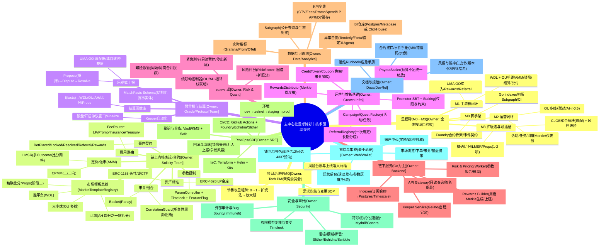

# 去中心化足球博彩 - 技术架构思维导图

## 说明

本思维导图展示了去中心化足球博彩平台的完整技术架构，包含：

- **项目治理**：PMO、里程碑规划、风险管理
- **链上内核**：核心合约、市场模板、AMM、串关逻辑
- **预言机与结算**：乐观式上报、结算函数库、Keeper自动化
- **运营增长**：推荐系统、奖励分发、活动管理
- **风控引擎**：曝险管理、联动控制、风险评分
- **链下服务**：索引器、API网关、定价工作器
- **数据可观测**：Subgraph、监控告警、BI分析
- **DevOps/SRE**：CI/CD、基础设施、密钥管理
- **安全审计**：静态分析、模糊测试、外部审计
- **前端集成**：钱包、市场界面、运营后台
- **文档规范**：接口文档、运维手册、白皮书
- **里程碑**：M0-M3 分阶段交付计划

各模块负责团队已在节点名称后用圆括号标注。
