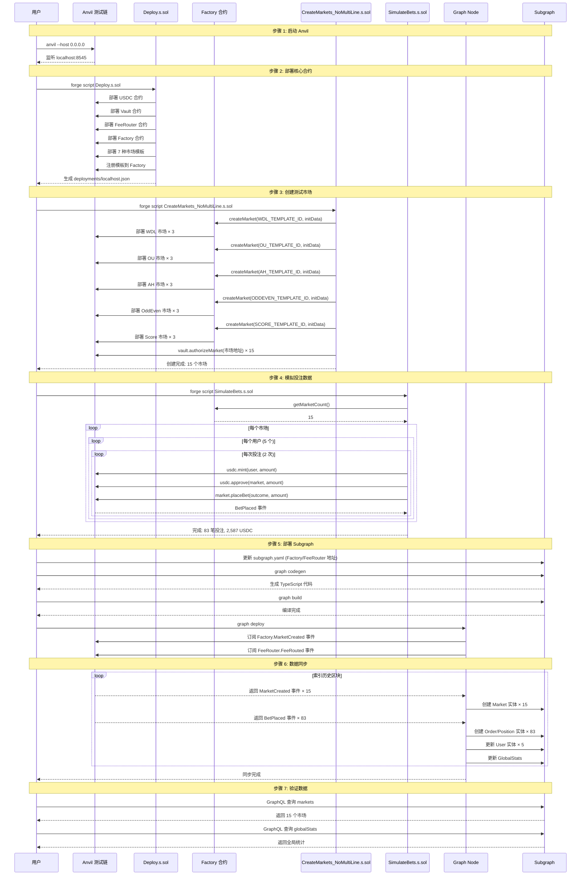
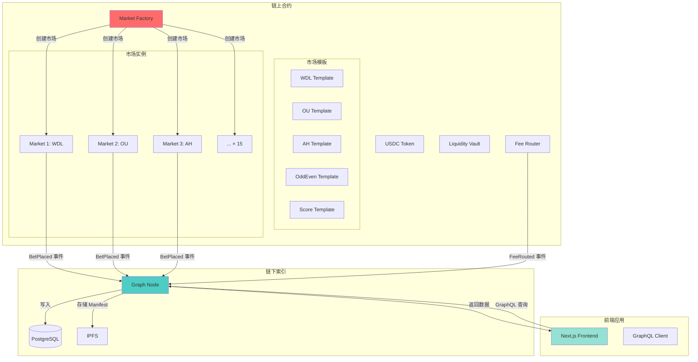
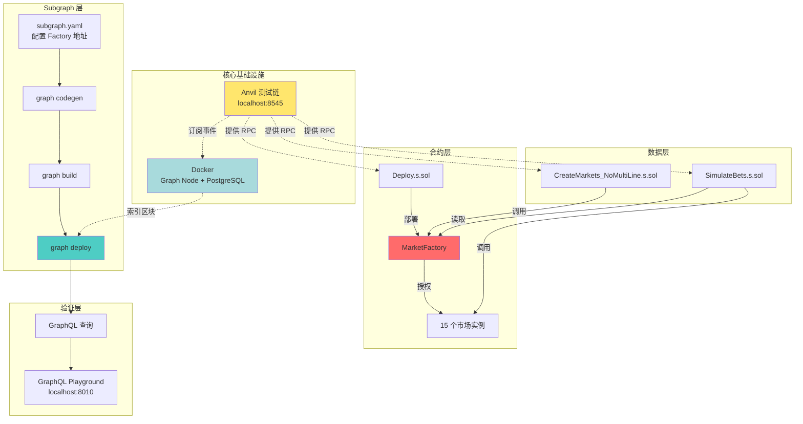
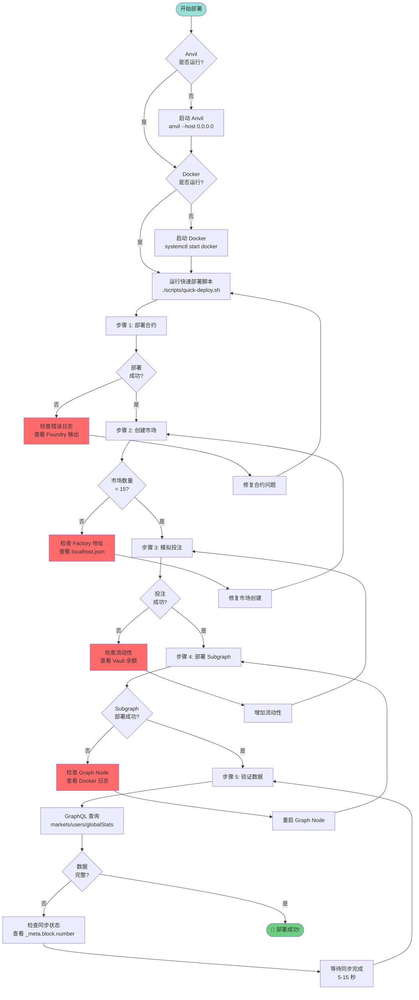

# PitchOne 本地部署流程图

本文档提供可视化的部署流程说明。

## 🔄 完整部署流程（时序图）

## 📊 数据流向图

## 🔐 权限与依赖关系图

## 🚀 快速部署决策树

## 📋 检查清单

### 部署前检查

- [ ] Anvil 已启动并监听 `localhost:8545`
- [ ] Docker 已启动并运行正常
- [ ] 项目依赖已安装（`forge`, `graph-cli`, `jq`）
- [ ] `scripts/quick-deploy.sh` 有执行权限

### 部署后验证

- [ ] `deployments/localhost.json` 存在且包含所有合约地址
- [ ] Factory 合约的 `getMarketCount()` 返回 15
- [ ] Subgraph 可通过 `http://localhost:8010` 访问
- [ ] GraphQL 查询返回 15 个市场
- [ ] `globalStats.totalVolume` ≈ 2,587 USDC
- [ ] `globalStats.totalUsers` = 5

### 常见错误检查

- [ ] 端口冲突：8545 (Anvil), 8010/8020/8030 (Graph Node), 5001 (IPFS)
- [ ] 合约地址不匹配：`subgraph.yaml` 与 `localhost.json` 一致
- [ ] Subgraph 版本：确保使用最新的 schema 和 mapping
- [ ] 区块同步：`_meta.block.number` 达到当前区块高度

## 🔗 相关资源

- [完整 SOP 文档](./SOP_LOCAL_DEPLOYMENT.md)
- [快速部署脚本](../scripts/quick-deploy.sh)
- [Subgraph Schema](./schema.graphql)
- [合约部署说明](../contracts/README.md)

---

**最后更新**: 2025-11-14
**验证环境**: Anvil (Foundry), Graph Node v0.34.1, PostgreSQL 14
