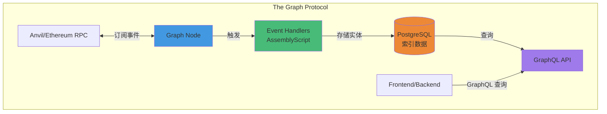
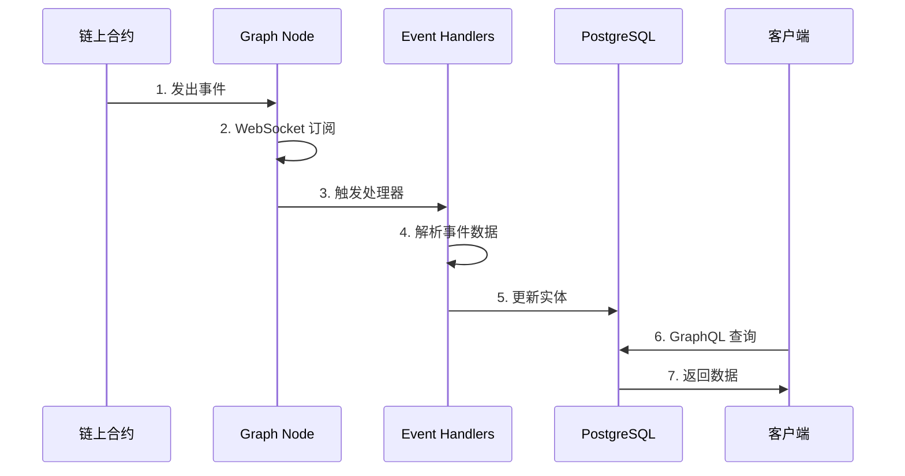
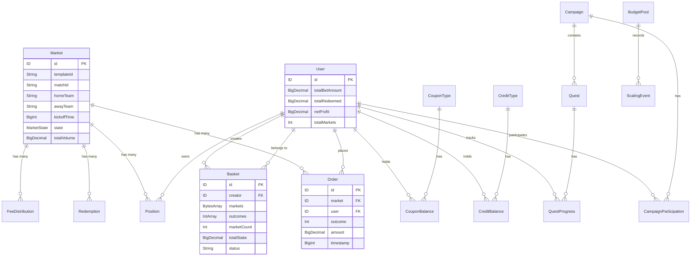
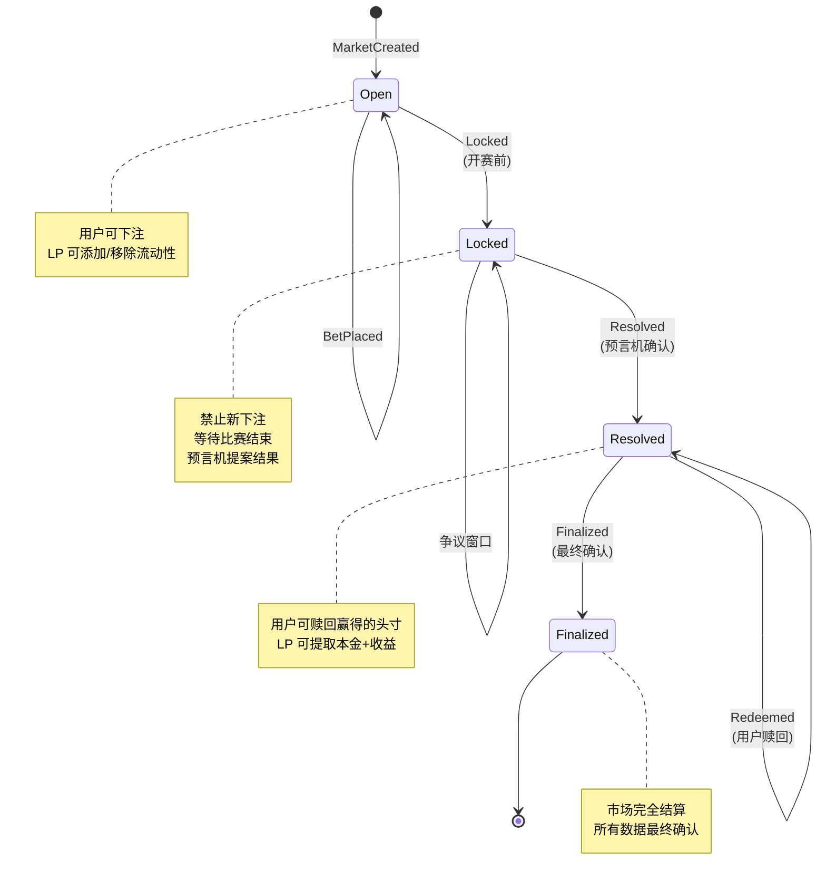
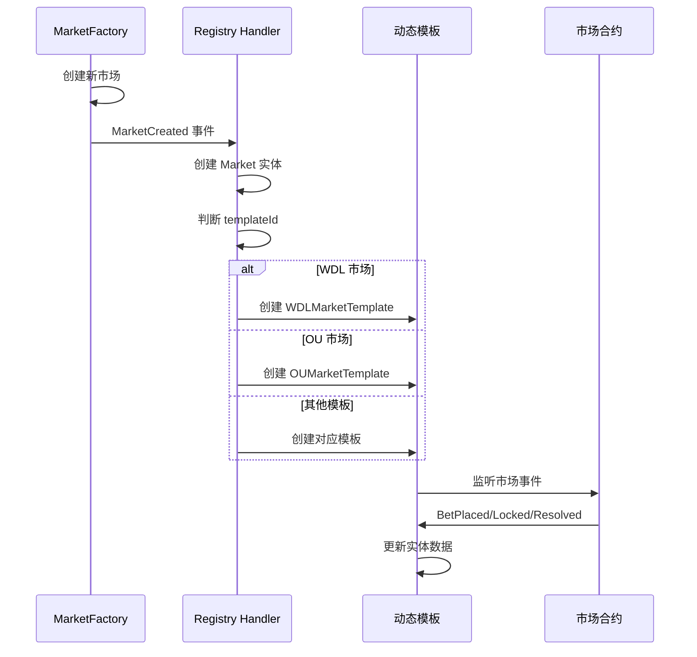

# PitchOne Subgraph 设计文档

## 概述

PitchOne Subgraph 是基于 The Graph 协议的链上数据索引服务，为去中心化体育预测平台提供高效的数据查询能力。

## 架构设计

### 核心组件



### 数据流



## Schema 设计

### 实体关系图



### 核心实体

#### Market（市场）
```graphql
type Market @entity {
  id: ID!                      # 市场合约地址
  templateId: String!          # 模板 ID（WDL/OU/AH/等）
  matchId: String!             # 赛事 ID
  homeTeam: String!            # 主队名称
  awayTeam: String!            # 客队名称
  kickoffTime: BigInt!         # 开赛时间
  state: MarketState!          # 市场状态
  totalVolume: BigDecimal!     # 总交易量
  feeAccrued: BigDecimal!      # 累计手续费
  lpLiquidity: BigDecimal!     # LP 流动性
  uniqueBettors: Int!          # 唯一下注用户数

  # 关系
  orders: [Order!]! @derivedFrom(field: "market")
  positions: [Position!]! @derivedFrom(field: "market")

  # 扩展字段（特定模板）
  line: BigInt                 # 大小球盘口线（单线）
  lines: [BigInt!]             # 大小球盘口线（多线）
  playerId: String             # 球员 ID（PlayerProps）
  playerName: String           # 球员姓名（PlayerProps）
  propType: String             # 道具类型（PlayerProps）
}

enum MarketState {
  Open
  Locked
  Resolved
  Finalized
}
```

**市场生命周期状态机**：



#### User（用户）
```graphql
type User @entity {
  id: ID!                      # 用户地址
  totalBetAmount: BigDecimal!  # 总下注金额
  totalRedeemed: BigDecimal!   # 总赎回金额
  netProfit: BigDecimal!       # 净盈利
  totalMarkets: Int!           # 参与市场数
  totalOrders: Int!            # 总订单数

  # 关系
  orders: [Order!]! @derivedFrom(field: "user")
  positions: [Position!]! @derivedFrom(field: "owner")
  baskets: [Basket!]! @derivedFrom(field: "creator")
}
```

#### Order（订单）
```graphql
type Order @entity {
  id: ID!                      # txHash-logIndex
  market: Market!              # 关联市场
  user: User!                  # 下注用户
  outcome: Int!                # 投注结果
  amount: BigDecimal!          # 下注金额（USDC）
  shares: BigInt!              # 获得的头寸份额
  timestamp: BigInt!           # 下注时间
  blockNumber: BigInt!         # 区块高度
  transactionHash: Bytes!      # 交易哈希
}
```

#### Position（头寸）
```graphql
type Position @entity {
  id: ID!                      # market-user-outcome
  market: Market!              # 关联市场
  owner: User!                 # 持有人
  outcome: Int!                # 头寸对应结果
  balance: BigInt!             # 当前余额
  totalBought: BigInt!         # 累计买入
  totalSold: BigInt!           # 累计卖出
  lastUpdated: BigInt!         # 最后更新时间
}
```

#### Basket（串关）
```graphql
type Basket @entity {
  id: ID!                      # Parlay ID
  creator: User!               # 创建者
  markets: [Bytes!]!           # 串关包含的市场地址
  outcomes: [Int!]!            # 每个市场对应的投注结果
  marketCount: Int!            # 串关腿数（2-8）
  totalStake: BigDecimal!      # 总投注金额
  potentialPayout: BigDecimal! # 潜在支付
  combinedOdds: BigDecimal!    # 组合赔率
  correlationDiscount: Int!    # 相关性折扣（基点）
  adjustedOdds: BigDecimal!    # 调整后赔率
  status: String!              # Pending/Won/Lost/Refunded
  actualPayout: BigDecimal     # 实际支付（结算后）
  createdAt: BigInt!           # 创建时间
  settledAt: BigInt            # 结算时间
}
```

### 运营实体

#### Campaign（活动）
```graphql
type Campaign @entity {
  id: ID!                      # Campaign ID (bytes32)
  name: String!                # 活动名称
  campaignType: Bytes!         # 活动类型
  totalBudget: BigDecimal!     # 总预算
  usedBudget: BigDecimal!      # 已使用预算
  startTime: BigInt!           # 开始时间
  endTime: BigInt!             # 结束时间
  status: String!              # Active/Paused/Ended
  participantCount: Int!       # 参与人数

  # 关系
  participations: [CampaignParticipation!]! @derivedFrom(field: "campaign")
}
```

#### Quest（任务）
```graphql
type Quest @entity {
  id: ID!                      # Quest ID (bytes32)
  name: String!                # 任务名称
  questType: String!           # 任务类型（BET/REFERRAL/PARLAY/等）
  targetValue: BigInt!         # 目标值
  rewardAmount: BigDecimal!    # 奖励金额
  startTime: BigInt!           # 开始时间
  endTime: BigInt!             # 结束时间
  status: String!              # Active/Paused/Ended
  completedCount: Int!         # 完成人数

  # 关系
  progresses: [QuestProgress!]! @derivedFrom(field: "quest")
}
```

#### CreditToken（免佣券）
```graphql
type CreditType @entity {
  id: ID!                      # Credit Type ID
  value: BigDecimal!           # 券面值（USDC）
  discountBps: Int!            # 折扣（基点）
  validityDuration: BigInt!    # 有效期（秒）
  maxUsagePerUser: Int!        # 单用户最大使用次数
  status: String!              # Active/Paused
  totalMinted: BigInt!         # 总发行量
  totalUsed: Int!              # 总使用次数
}

type CreditBalance @entity {
  id: ID!                      # typeId-userAddress
  creditType: CreditType!      # 券种
  user: Bytes!                 # 用户地址
  balance: BigInt!             # 当前余额
  usedCount: Int!              # 已使用次数
}
```

### 统计实体

#### GlobalStats（全局统计）
```graphql
type GlobalStats @entity {
  id: ID!                      # "global"
  totalMarkets: Int!           # 总市场数
  activeMarkets: Int!          # 活跃市场数
  resolvedMarkets: Int!        # 已结算市场数
  totalUsers: Int!             # 总用户数
  totalVolume: BigDecimal!     # 总交易量
  totalFees: BigDecimal!       # 总手续费
  totalLiquidity: BigDecimal!  # 总流动性
  lastUpdated: BigInt!         # 最后更新时间
}
```

## 事件处理器设计

### 核心处理器

| 文件 | 合约 | 事件数 | 说明 |
|------|------|--------|------|
| `registry.ts` | MarketFactory_v2 | 3 | 市场创建、模板注册 |
| `market.ts` | Market Templates | 10+ | 市场生命周期事件 |
| `fee.ts` | FeeRouter | 2 | 费用接收与分发 |
| `oracle.ts` | MockOracle | 3 | 预言机提案与争议 |
| `basket.ts` | Basket | 2 | 串关创建与结算 |
| `campaign.ts` | Campaign | 5 | 活动管理 |
| `quest.ts` | Quest | 5 | 任务管理 |
| `credit.ts` | CreditToken | 6 | 免佣券管理 |
| `coupon.ts` | Coupon | 3 | 赔率加成券 |
| `scaler.ts` | PayoutScaler | 4 | 预算缩放 |
| `correlation.ts` | CorrelationGuard | 1 | 相关性规则 |

### 动态模板索引

使用 The Graph 的动态数据源功能，自动索引新创建的市场。

**流程图**：



**技术实现**：

```yaml
# subgraph.yaml
templates:
  - name: WDLMarket
    kind: ethereum/contract
    source:
      abi: WDL_Template_V2
    mapping:
      kind: ethereum/events
      apiVersion: 0.0.7
      language: wasm/assemblyscript
      file: ./src/market.ts
      entities:
        - Market
        - Order
        - Position
      abis:
        - name: WDL_Template_V2
          file: ../contracts/out/WDL_Template_V2.sol/WDL_Template_V2.json
      eventHandlers:
        - event: BetPlaced(indexed address,indexed uint256,uint256,uint256)
          handler: handleBetPlaced
        - event: Locked()
          handler: handleLocked
        - event: Resolved(uint256)
          handler: handleResolved
```

当 `MarketCreated` 事件触发时，动态创建对应模板的数据源：

```typescript
// registry.ts
export function handleMarketCreatedFromRegistry(event: MarketCreatedEvent): void {
  // 1. 创建 Market 实体
  let market = new Market(event.params.market.toHexString());
  market.templateId = event.params.templateId.toString();
  market.save();

  // 2. 动态创建数据源
  if (templateId == "WDL") {
    WDLMarketTemplate.create(event.params.market);
  } else if (templateId == "OU") {
    OUMarketTemplate.create(event.params.market);
  }
  // ...
}
```

## 数据精度处理

### BigInt vs BigDecimal

- **链上存储（BigInt）**: 18 位小数（wei）
- **显示金额（BigDecimal）**: USDC 6 位小数

```typescript
import { BigInt, BigDecimal } from "@graphprotocol/graph-ts";

// 辅助函数：将 BigInt 转换为 BigDecimal
export function toDecimal(value: BigInt, decimals: u8): BigDecimal {
  let divisor = BigInt.fromI32(10).pow(decimals);
  return value.divDecimal(divisor.toBigDecimal());
}

// 使用示例
let amountWei = event.params.amount; // BigInt (wei)
let amountUSDC = toDecimal(amountWei, 6); // BigDecimal (USDC)
order.amount = amountUSDC;
```

### 实体 ID 设计

| 实体 | ID 格式 | 示例 |
|------|---------|------|
| Market | 市场合约地址 | `0x1234...` |
| User | 用户地址 | `0xabcd...` |
| Order | `txHash-logIndex` | `0x5678...-12` |
| Position | `market-user-outcome` | `0x1234...-0xabcd...-0` |
| Basket | Parlay ID (uint256) | `1` |
| Campaign | Campaign ID (bytes32) | `0x1a2b...` |

## 性能优化

### 1. 使用 @derivedFrom 减少冗余存储

```graphql
type Market @entity {
  orders: [Order!]! @derivedFrom(field: "market")
}
```

避免在 Market 实体中手动维护 orders 数组，由 The Graph 自动反向查询。

### 2. 合理设计索引

```graphql
type Order @entity {
  market: Market!  # 索引
  user: User!      # 索引
}
```

经常用于过滤查询的字段设为关系类型，自动创建索引。

### 3. 避免复杂计算

将复杂计算移至链下，handler 中仅做简单聚合：

```typescript
// ✅ 好的做法：简单增量更新
user.totalBetAmount = user.totalBetAmount.plus(order.amount);

// ❌ 坏的做法：遍历所有订单重新计算
let total = BigDecimal.fromString("0");
for (let i = 0; i < user.orders.length; i++) {
  total = total.plus(user.orders[i].amount);
}
```

### 4. 批量查询优化

```graphql
# ✅ 使用分页和排序
query {
  orders(
    first: 100,
    skip: 0,
    orderBy: timestamp,
    orderDirection: desc
  ) {
    id
    amount
  }
}

# ❌ 避免查询全部数据
query {
  orders {
    id
    amount
  }
}
```

## 测试策略

### 1. 单元测试（Matchstick）

```typescript
import { test, assert } from "matchstick-as/assembly/index";
import { handleBetPlaced } from "../src/market";

test("BetPlaced event creates Order entity", () => {
  // 创建模拟事件
  let event = createBetPlacedEvent(...);

  // 调用 handler
  handleBetPlaced(event);

  // 断言
  assert.entityCount("Order", 1);
  assert.fieldEquals("Order", orderId, "amount", "100");
});
```

### 2. 集成测试（端到端）

```bash
# 1. 启动本地 Graph Node
docker compose up -d

# 2. 部署 Subgraph
./deploy-local.sh

# 3. 运行合约集成测试生成事件
cd ../contracts && forge test

# 4. 验证 GraphQL 查询
./test-queries.sh
```

## 部署流程

### 本地开发

```bash
# 1. 安装依赖
npm install

# 2. 生成代码
npm run codegen

# 3. 构建
npm run build

# 4. 部署（需 Graph Node 运行）
./deploy-local.sh
```

### 测试网/主网

```bash
# 1. 更新 subgraph.yaml 中的网络和合约地址
network: sepolia
address: "0xYourContractAddress"
startBlock: 12345678

# 2. 认证 The Graph Studio
graph auth --studio YOUR_DEPLOY_KEY

# 3. 部署
graph deploy --studio pitchone
```

## 监控与维护

### 关键指标

- **索引延迟**: 当前区块 - 最新索引区块
- **查询响应时间**: P50/P95/P99
- **索引错误率**: 失败的事件处理数 / 总事件数
- **数据一致性**: 定期校验链上数据与 Subgraph 数据

### 告警规则

- 索引延迟 > 10 分钟
- 查询 P95 响应时间 > 500ms
- 索引错误率 > 0.1%
- Graph Node 内存使用 > 80%

## 版本历史

| 版本 | 日期 | 说明 |
|------|------|------|
| v0.3.0 | 2025-11-08 | M3: 新增 Basket 串关、PlayerProps 球员道具市场支持 |
| v0.2.0 | 2025-11-05 | M2: 新增运营工具（Campaign/Quest/Credit/Coupon/Scaler） |
| v0.1.0 | 2025-10-31 | M1: 核心市场功能（WDL/OU/费用/预言机） |

## 参考资料

- [The Graph 官方文档](https://thegraph.com/docs/)
- [AssemblyScript 语法指南](https://www.assemblyscript.org/)
- [Matchstick 测试框架](https://github.com/LimeChain/matchstick)
- [PitchOne 合约文档](../contracts/README.md)
