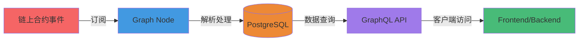

# PitchOne Subgraph

基于 The Graph 协议的 PitchOne 去中心化体育预测平台数据索引服务。

## 📚 文档导航

| 文档 | 描述 | 适用人群 |
|------|------|----------|
| **[DESIGN.md](./DESIGN.md)** | Subgraph 架构设计与技术实现 | 开发者、架构师 |
| **[USAGE.md](./USAGE.md)** | 使用指南、部署流程、GraphQL 查询示例 | 开发者、运维、前端 |

## 🚀 快速开始

```bash
# 1. 安装依赖
npm install

# 2. 一键部署（需本地 Anvil 和 Docker）
./deploy.sh

# 3. 访问 GraphQL Playground
open http://localhost:8010/subgraphs/name/pitchone-sportsbook/graphql
```

详细步骤请参阅 [USAGE.md](./USAGE.md)。

## 🏗️ 架构概览



**核心能力**：
- **市场模板**: WDL、OU、OU_MultiLine、AH、OddEven、Score、PlayerProps（7种）
- **核心功能**: 市场索引、订单追踪、头寸管理、串关、运营工具
- **数据规模**: 30+ 实体类型，50+ 事件处理器

## 📊 项目状态

**当前版本**: v0.3.0 | **最后更新**: 2025-11-12

| 模块 | 状态 | 说明 |
|------|------|------|
| Schema 定义 | ✅ 100% | 30+ 实体类型 |
| 事件处理器 | ✅ 100% | 50+ 事件，100% 编译通过 |
| 本地部署 | ✅ 成功 | Graph Node v0.34.1 |
| 测试网部署 | ⏳ 待完成 | Sepolia / Arbitrum Sepolia |

### 功能完成度

| 里程碑 | 模块 | 状态 |
|--------|------|------|
| M1 核心 | 市场注册、WDL/OU 模板、费用路由、预言机 | ✅ 100% |
| M2 运营 | Campaign、Quest、CreditToken、Coupon、PayoutScaler | ✅ 100% |
| M3 扩展 | Basket 串关、PlayerProps、Score（LMSR） | ✅ 100% |

### 已知问题

| 优先级 | 问题 | 解决方案 |
|--------|------|----------|
| P1 | FirstScorer 球员列表缺失 | 短期：客户端从链下获取；长期：合约添加 getter |
| P1 | IPFS 固定策略未配置 | 部署到 The Graph Studio 时配置 |

## 🔗 相关资源

- **合约代码**: [../contracts](../contracts)
- **项目文档**: [../docs](../docs)
- **The Graph 官方文档**: https://thegraph.com/docs/

## 📝 License

MIT
