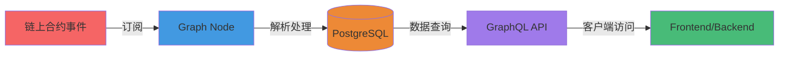

# PitchOne Subgraph

基于 The Graph 协议的 PitchOne 去中心化体育预测平台数据索引服务。

## 📚 文档导航

本项目包含以下核心文档：

| 文档 | 描述 | 适用人群 |
|------|------|----------|
| **[DESIGN.md](./DESIGN.md)** | Subgraph 架构设计与技术实现 | 开发者、架构师 |
| **[STATUS.md](./STATUS.md)** | 项目进度、部署状态与技术债务 | 项目管理、开发者 |
| **[USAGE.md](./USAGE.md)** | 使用指南、GraphQL 查询示例、脚本说明 | 开发者、运维、前端 |

## 🚀 快速开始

```bash
# 1. 安装依赖
npm install

# 2. 一键部署（需本地 Anvil 和 Docker）
./deploy-local.sh

# 3. 访问 GraphQL Playground
open http://localhost:8010/subgraphs/name/pitchone-local/graphql
```

详细步骤请参阅 [USAGE.md](./USAGE.md)。

## 🏗️ 架构概览



**核心能力**：
- **市场模板**: WDL、OU、OU_MultiLine、AH、OddEven、Score、PlayerProps（7种）
- **核心功能**: 市场索引、订单追踪、头寸管理、串关、运营工具
- **数据规模**: 30+ 实体类型，50+ 事件处理器

详细架构设计请参阅 [DESIGN.md](./DESIGN.md)。

## 📊 当前状态

| 指标 | 状态 |
|------|------|
| 版本 | v0.3.0 |
| 本地部署 | ✅ 成功 |
| 测试网部署 | ⏳ 待完成 |
| 编译状态 | ✅ 100% 通过 |
| 数据一致性 | ✅ 已验证 |

详细进度请参阅 [STATUS.md](./STATUS.md)。

## 🔗 相关资源

- **合约代码**: [../contracts](../contracts)
- **项目文档**: [../docs](../docs)
- **The Graph 官方文档**: https://thegraph.com/docs/

## 📝 License

MIT
