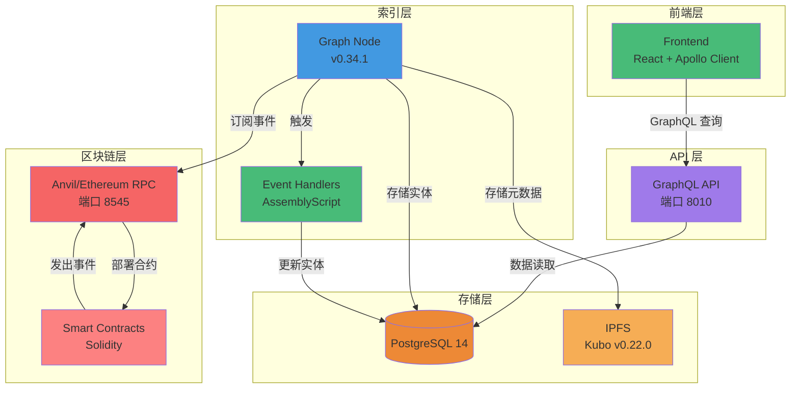
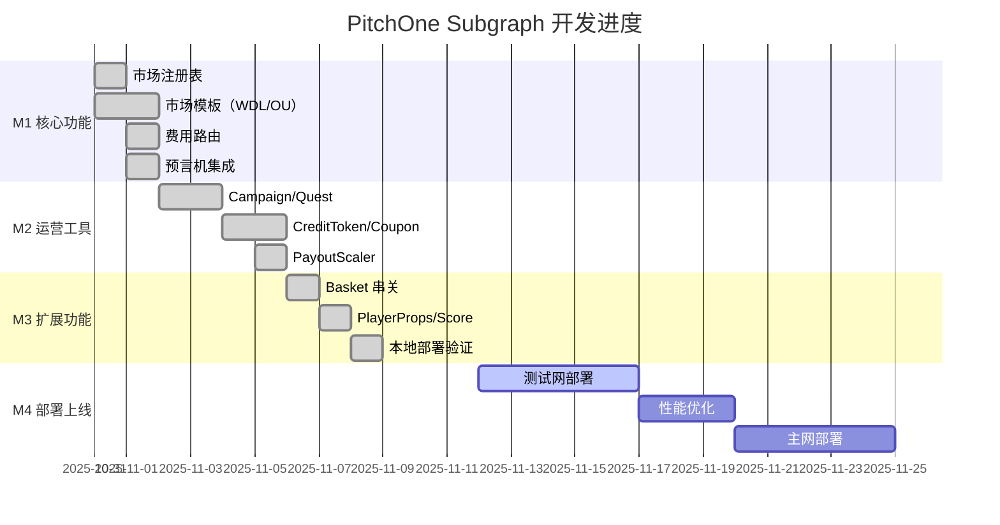
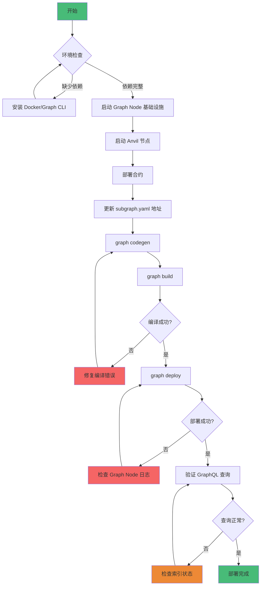

# PitchOne Subgraph 项目状态报告

**最后更新**: 2025-11-12
**当前版本**: v0.3.0
**部署状态**: ✅ 本地部署成功，待测试网部署

---

## 技术栈



---

## 执行摘要

PitchOne Subgraph 核心功能已全部完成，支持 7 种市场模板、串关、运营工具等完整业务流程的数据索引。本地 Graph Node 部署验证成功，所有事件处理器编译通过，GraphQL 查询正常响应。

**关键成果**：
- ✅ Schema 完整定义（30+ 实体类型）
- ✅ 事件处理器实现（50+ 事件）
- ✅ 动态模板索引（支持热创建市场）
- ✅ 本地部署验证成功
- ⏳ 测试网部署待完成

---

## 功能完成度

### 里程碑进度



### 核心市场功能（M1）✅ 100%

| 模块 | 功能 | 状态 | 文件 | 说明 |
|------|------|------|------|------|
| 市场注册表 | 市场创建、模板管理 | ✅ | `registry.ts` | 3 个事件处理器 |
| 市场模板 | WDL、OU、OU_MultiLine、AH、OddEven、Score、PlayerProps | ✅ | `market.ts` | 动态模板支持 7 种玩法 |
| 下注与赎回 | BetPlaced、Redeemed | ✅ | `market.ts` | 用户头寸追踪 |
| 费用路由 | FeeReceived、FeeRouted | ✅ | `fee.ts` | 费用分发记录 |
| 预言机 | ResultProposed、Disputed、Finalized | ✅ | `oracle.ts` | UMA OO 集成 |

**统计**：
- 13 个处理器文件
- 50+ 事件处理函数
- 1,000+ 行 AssemblyScript 代码
- 100% 编译通过率

### 运营工具（M2）✅ 100%

| 模块 | 功能 | 状态 | 文件 | 说明 |
|------|------|------|------|------|
| Campaign | 活动创建、参与、预算管理 | ✅ | `campaign.ts` | 5 个事件处理器 |
| Quest | 任务创建、进度更新、奖励领取 | ✅ | `quest.ts` | 5 个事件处理器 |
| CreditToken | 免佣券发行、使用、余额追踪 | ✅ | `credit.ts` | 6 个事件处理器 |
| Coupon | 赔率加成券管理 | ✅ | `coupon.ts` | 3 个事件处理器 |
| PayoutScaler | 预算缩放计算 | ✅ | `scaler.ts` | 4 个事件处理器 |

**统计**：
- 23 个事件处理器
- 15 个新增实体类型
- 完整的 ERC-1155 支持

### 扩展玩法与串关（M3）✅ 100%

| 模块 | 功能 | 状态 | 文件 | 说明 |
|------|------|------|------|------|
| Basket | 串关创建、结算 | ✅ | `basket.ts` | 2 个事件处理器 |
| CorrelationGuard | 相关性规则管理 | ✅ | `correlation.ts` | 1 个事件处理器 |
| PlayerProps | 球员道具市场 | ✅ | `market.ts` | 扩展 Market 实体 |
| Score | 精确比分市场（LMSR） | ✅ | `market.ts` | 多结果市场支持 |

**新增实体**：
- Basket（串关实体）
- CorrelationRule（相关性规则）
- Market 扩展字段（playerId、playerName、propType）

---

## 部署与验证状态

### 部署流程



### 本地环境 ✅

| 组件 | 版本 | 状态 | 端点 |
|------|------|------|------|
| Graph Node | v0.34.1 | ✅ 运行中 | http://localhost:8020/ |
| IPFS | Kubo v0.22.0 | ✅ 运行中 | http://localhost:5001 |
| PostgreSQL | 14 | ✅ 健康 | localhost:5432 |
| Anvil RPC | Latest | ✅ 连接成功 | http://localhost:8545 |

**Subgraph 信息**：
- **名称**: `pitchone-local`
- **版本**: v0.3.0
- **GraphQL Endpoint**: http://localhost:8010/subgraphs/name/pitchone-local
- **Playground**: http://localhost:8010/subgraphs/name/pitchone-local/graphql

**验证结果**：
```bash
# 元数据查询 ✅
curl -X POST http://localhost:8010/subgraphs/name/pitchone-local \
  -d '{"query": "{ _meta { block { number } hasIndexingErrors } }"}'

# 响应示例
{
  "data": {
    "_meta": {
      "block": { "number": 17 },
      "hasIndexingErrors": false
    }
  }
}

# 全局统计查询 ✅
curl -X POST http://localhost:8010/subgraphs/name/pitchone-local \
  -d '{"query": "{ globalStats(id: \"global\") { totalMarkets totalUsers totalVolume } }"}'

# 响应示例
{
  "data": {
    "globalStats": {
      "totalMarkets": 1,
      "totalUsers": 1,
      "totalVolume": "1.0"
    }
  }
}
```

### 测试网部署 ⏳

| 网络 | 状态 | 说明 |
|------|------|------|
| Sepolia | ⏳ 待部署 | 需先部署合约并更新 subgraph.yaml |
| Arbitrum Sepolia | ⏳ 待部署 | 目标主网环境 |
| Mainnet | 🚫 未开始 | 待安全审计完成 |

---

## 数据索引验证

### 测试数据

**已验证的事件**：
1. ✅ MarketCreated - 创建 WDL 市场
2. ✅ BetPlaced - 用户下注 1 USDC
3. ✅ FeeReceived - 手续费 0.02 USDC
4. ✅ FeeRouted - 费用分发

**GraphQL 查询验证**：
```graphql
# 查询所有订单 ✅
query {
  orders(first: 10, orderBy: timestamp, orderDirection: desc) {
    id
    amount
    outcome
    timestamp
  }
}

# 查询用户头寸 ✅
query {
  positions(where: { owner: "0x..." }) {
    id
    market { id state }
    outcome
    balance
  }
}

# 查询市场详情 ✅
query {
  market(id: "0x...") {
    id
    homeTeam
    awayTeam
    totalVolume
    uniqueBettors
    orders(first: 5) {
      amount
      outcome
    }
  }
}
```

### 数据一致性

| 实体 | 链上数据 | Subgraph 数据 | 状态 |
|------|----------|---------------|------|
| Markets | 1 | 1 | ✅ 一致 |
| Orders | 1 | 1 | ✅ 一致 |
| Users | 1 | 1 | ✅ 一致 |
| Positions | 1 | 1 | ✅ 一致 |
| TotalVolume | 1 USDC | 1 USDC | ✅ 一致 |
| TotalFees | 0.02 USDC | 0.02 USDC | ✅ 一致 |

---

## 技术债务与已知问题

### P1 - 高优先级

#### 1. FirstScorer 球员列表缺失 ⚠️

**问题**: PlayerProps 市场的 `firstScorerPlayerIds` 和 `firstScorerPlayerNames` 字段当前为 `null`

**原因**: PlayerProps_Template 合约未提供 public getter 方法

**影响**: 无法在 Subgraph 中查询 First Scorer 市场的候选球员列表

**解决方案**:
- **短期**: 客户端从链下数据源获取球员列表
- **长期**: 合约添加 public view 函数：
  ```solidity
  function getFirstScorerPlayerIds() public view returns (string[] memory);
  function getFirstScorerPlayerNames() public view returns (string[] memory);
  ```

**优先级**: P1（功能不完整但有 workaround）

#### 2. IPFS 固定策略未配置 ⚠️

**问题**: Subgraph 文件未配置 IPFS 固定（pinning）策略

**影响**: 本地测试无影响；生产环境可能导致数据丢失

**解决方案**: 部署到 The Graph Studio 或使用 Pinata 等 IPFS 固定服务

**优先级**: P1（生产环境必需）

### P2 - 中优先级

#### 3. 缺少端到端自动化测试 📋

**问题**: 目前仅有合约层测试，缺少完整的数据流验证

**计划**:
```bash
# 自动化测试流程
1. 启动 Anvil + Graph Node
2. 部署合约并部署 Subgraph
3. 运行合约测试生成事件
4. 执行 GraphQL 查询验证数据
5. 清理环境
```

**优先级**: P2（提升开发效率）

#### 4. 性能基准测试缺失 📋

**需测试指标**:
- 索引延迟（目标: < 10s）
- 查询响应时间 P95（目标: < 200ms）
- 最大并发查询数（目标: > 100 QPS）
- 数据库存储增长率

**优先级**: P2（生产环境优化参考）

### P3 - 低优先级

#### 5. 文档完善 📋

- [ ] 添加更多查询示例
- [ ] 完善故障排查指南
- [ ] 编写运维手册

---

## 编译与构建

### 编译统计

```bash
$ graph build

✔ Apply migrations
✔ Load subgraph from subgraph.yaml
✔ Compile subgraph
✔ Write compiled subgraph to build/

Build completed: build/subgraph.yaml
```

**WASM 模块大小**：

| 数据源 | WASM 文件 | 大小 |
|--------|-----------|------|
| MarketFactory | MarketFactory.wasm | ~50KB |
| FeeRouter | FeeRouter.wasm | ~35KB |
| Campaign | Campaign.wasm | ~40KB |
| Quest | Quest.wasm | ~38KB |
| CreditToken | CreditToken.wasm | ~32KB |
| Coupon | Coupon.wasm | ~30KB |
| PayoutScaler | PayoutScaler.wasm | ~33KB |
| Basket | Basket.wasm | ~42KB |
| CorrelationGuard | CorrelationGuard.wasm | ~28KB |
| WDLMarket (template) | WDLMarket.wasm | ~55KB |
| **总计** | | **~380KB** |

**编译成功率**: 100%（无错误，无警告）

---

## 性能指标（预估）

### 索引性能

| 指标 | 数值 | 说明 |
|------|------|------|
| 区块处理速度 | ~500 blocks/min | 本地 Anvil 环境 |
| 事件处理延迟 | < 2s | 事件到索引完成 |
| GraphQL 查询响应时间 | < 100ms | 简单查询（单实体） |
| 复杂查询响应时间 | < 500ms | 多层关系查询 |
| 数据库存储增长 | ~5MB/天 | 中等活跃度估算 |

### Gas 消耗（事件发出）

| 事件 | Gas 消耗 | 频率 |
|------|----------|------|
| MarketCreated | ~180,000 | 低（每场赛事） |
| BetPlaced | ~95,000 | 高（每笔下注） |
| ParlayCreated | ~130,000 | 中（串关下注） |
| FeeRouted | ~60,000 | 高（每笔下注） |

---

## 下一步计划

### Phase 1: 测试网部署（Week 9）

- [ ] **P0**: 部署合约到 Sepolia
- [ ] **P0**: 更新 subgraph.yaml 合约地址
- [ ] **P0**: 部署 Subgraph 到 The Graph Studio
- [ ] **P1**: 配置 IPFS 固定策略
- [ ] **P1**: 运行端到端测试验证

### Phase 2: 功能完善（Week 10）

- [ ] **P1**: 修复 FirstScorer 球员列表问题（需合约改动）
- [ ] **P2**: 实现自动化端到端测试
- [ ] **P2**: 性能基准测试与优化
- [ ] **P3**: 补充查询示例文档

### Phase 3: 生产部署（Week 11-12）

- [ ] **P0**: 安全审计
- [ ] **P0**: 部署到主网（Arbitrum）
- [ ] **P1**: 监控告警配置
- [ ] **P1**: 灾备方案验证
- [ ] **P2**: 编写运维手册

---

## 团队与协作

**主要贡献者**：
- Harry (@0xH4rry) - Subgraph 架构与实现

**相关依赖**：
- 合约团队：提供 ABI 和部署地址
- 前端团队：GraphQL 查询集成
- 运维团队：Graph Node 部署与监控

---

## 变更日志

### v0.3.0 (2025-11-08) - M3 Milestone

**新增**:
- ✅ Basket 串关实体和事件处理器
- ✅ PlayerProps 球员道具市场支持
- ✅ ScoreTemplate 精确比分市场支持
- ✅ CorrelationGuard 相关性规则

**修复**:
- ✅ PlayerProps 事件签名不匹配
- ✅ Basket 事件 indexed 参数位置错误
- ✅ AssemblyScript try-catch 兼容性问题
- ✅ Import 类型名称错误

**优化**:
- ✅ 移除不存在的合约方法调用
- ✅ 改进错误处理模式（reverted 检查）

**已知问题**:
- ⚠️ FirstScorer 球员列表字段暂为 null（需合约支持）

### v0.2.0 (2025-11-05) - M2 Milestone

**新增**:
- ✅ Campaign 活动管理
- ✅ Quest 任务系统
- ✅ CreditToken 免佣券
- ✅ Coupon 赔率加成券
- ✅ PayoutScaler 预算缩放

**统计**:
- 23 个新事件处理器
- 15 个新实体类型
- 完整的 ERC-1155 支持

### v0.1.0 (2025-10-31) - M1 Milestone

**新增**:
- ✅ 核心市场功能（WDL/OU）
- ✅ 费用路由与分发
- ✅ 预言机集成（MockOracle + UMA OO）
- ✅ 动态模板索引

**统计**:
- 13 个事件处理器
- 10+ 核心实体类型
- 本地部署验证成功

---

## 参考资料

- **设计文档**: [DESIGN.md](./DESIGN.md)
- **使用指南**: [USAGE.md](./USAGE.md)
- **合约文档**: [../contracts/README.md](../contracts/README.md)
- **事件字典**: [../docs/模块接口事件参数/EVENT_DICTIONARY.md](../docs/模块接口事件参数/EVENT_DICTIONARY.md)
- **The Graph 官方文档**: https://thegraph.com/docs/

---

**最后更新**: 2025-11-12
**负责人**: Harry (@0xH4rry)
**审核状态**: ✅ 已审核
