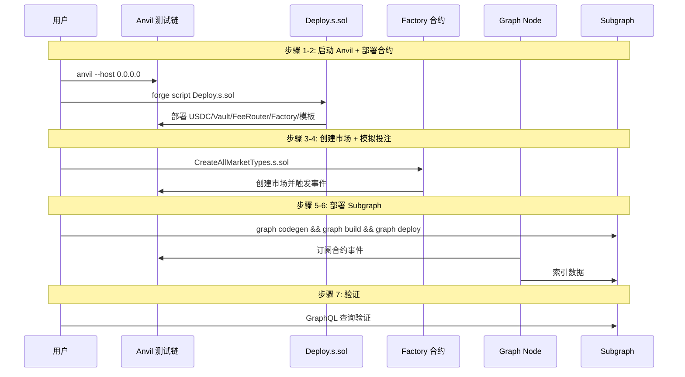
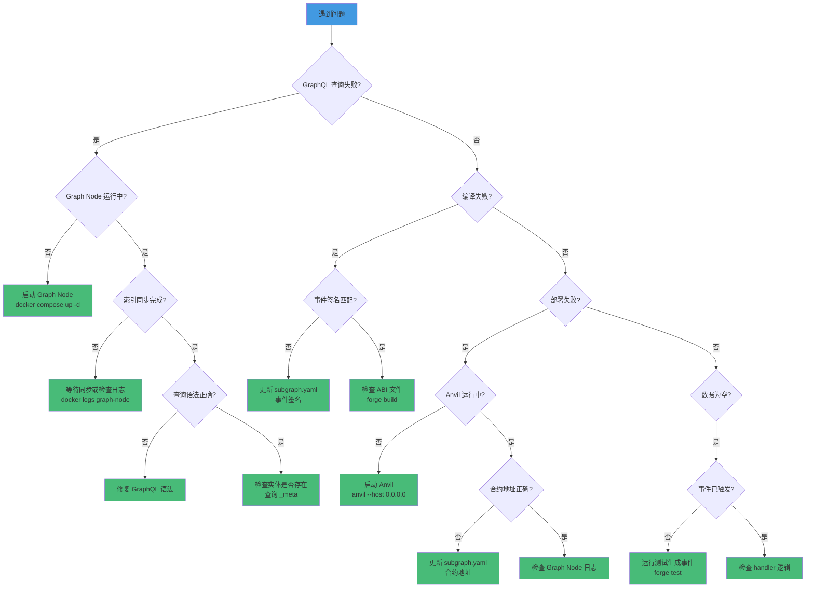

# PitchOne Subgraph 使用指南

本文档提供 Subgraph 的完整使用指南，包括本地部署、GraphQL 查询示例和常用开发命令。

## 目录

- [快速开始](#快速开始)
- [本地部署](#本地部署)
- [GraphQL 查询示例](#graphql-查询示例)
- [开发命令](#开发命令)
- [故障排查](#故障排查)

---

## 快速开始

### 前置要求

- Node.js >= 16
- Docker & Docker Compose
- Graph CLI: `npm install -g @graphprotocol/graph-cli`
- 本地 Anvil 节点运行中

### 一键部署

```bash
cd subgraph

# 方式 1: 使用自动化脚本（推荐）
./deploy.sh

# 方式 2: 手动步骤
npm install
npm run codegen
npm run build
npm run deploy-local
```

部署成功后，GraphQL Playground 可在以下地址访问：
- **查询端点**: http://localhost:8010/subgraphs/name/pitchone-sportsbook
- **Playground**: http://localhost:8010/subgraphs/name/pitchone-sportsbook/graphql

---

## 本地部署

### 部署流程概览



### 1. 启动 Graph Node 基础设施

```bash
cd subgraph

# 启动 Graph Node、PostgreSQL、IPFS
docker compose up -d

# 查看服务状态
docker compose ps

# 查看 Graph Node 日志
docker logs -f graph-node
```

**服务端点**：
- Graph Node RPC: http://localhost:8020/
- Graph Node Admin: http://localhost:8030/graphql
- IPFS API: http://localhost:5001
- PostgreSQL: localhost:5432

### 2. 启动本地 Anvil 节点

```bash
# 在另一个终端
cd contracts

# 启动 Anvil
anvil --host 0.0.0.0

# 或使用 Makefile
make chain
```

### 3. 部署合约

```bash
cd contracts

# 部署所有合约
forge script script/Deploy.s.sol:Deploy --rpc-url http://localhost:8545 --broadcast

# 记录部署的合约地址（需要更新到 subgraph.yaml）
```

### 4. 更新 Subgraph 配置

编辑 `subgraph/subgraph.yaml`，更新合约地址：

```yaml
dataSources:
  - kind: ethereum/contract
    name: MarketFactory
    source:
      address: "0xYourMarketFactoryAddress"  # 更新为实际地址
      startBlock: 1
```

### 5. 部署 Subgraph

```bash
cd subgraph

# 生成代码
npm run codegen

# 构建
npm run build

# 创建 Subgraph（首次）
npm run create-local

# 部署
npm run deploy-local
```

### 6. 验证部署

```bash
# 查询元数据
curl -X POST http://localhost:8010/subgraphs/name/pitchone-sportsbook \
  -H "Content-Type: application/json" \
  -d '{"query": "{ _meta { block { number } hasIndexingErrors } }"}'

# 查询全局统计
curl -X POST http://localhost:8010/subgraphs/name/pitchone-sportsbook \
  -H "Content-Type: application/json" \
  -d '{"query": "{ globalStats(id: \"global\") { totalMarkets totalUsers totalVolume } }"}'
```

### 部署脚本说明（deploy.sh）

自动化脚本执行以下步骤：

1. ✅ 检查依赖（Docker、Docker Compose、Graph CLI）
2. ✅ 启动 Graph Node 基础设施
3. ✅ 等待服务就绪（PostgreSQL、IPFS、Graph Node）
4. ✅ 检查 Anvil 节点状态
5. ✅ 运行 `graph codegen`
6. ✅ 运行 `graph build`
7. ✅ 创建 Subgraph（如果不存在）
8. ✅ 部署 Subgraph
9. ✅ 验证部署状态

**选项**：
```bash
# 清理模式（删除旧数据）
./deploy.sh --clean

# 跳过合约地址检查
SKIP_ADDRESS_CHECK=1 ./deploy.sh
```

---

## GraphQL 查询示例

### 基础查询

#### 1. 查询全局统计

```graphql
query GlobalStats {
  globalStats(id: "global") {
    totalMarkets
    activeMarkets
    resolvedMarkets
    totalUsers
    totalVolume
    totalFees
    totalLiquidity
    lastUpdated
  }
}
```

#### 2. 查询所有市场

```graphql
query AllMarkets {
  markets(
    first: 10
    orderBy: createdAt
    orderDirection: desc
  ) {
    id
    templateId
    matchId
    homeTeam
    awayTeam
    kickoffTime
    state
    totalVolume
    feeAccrued
    lpLiquidity
    uniqueBettors
    winnerOutcome
  }
}
```

#### 3. 查询特定市场详情

```graphql
query MarketDetails($marketId: ID!) {
  market(id: $marketId) {
    id
    templateId
    matchId
    homeTeam
    awayTeam
    kickoffTime
    state
    totalVolume
    uniqueBettors

    # 市场订单
    orders(first: 10, orderBy: timestamp, orderDirection: desc) {
      id
      user {
        id
      }
      outcome
      amount
      shares
      timestamp
    }

    # 市场头寸
    positions(where: { balance_gt: "0" }) {
      id
      owner {
        id
      }
      outcome
      balance
    }
  }
}
```

**变量**：
```json
{
  "marketId": "0x1234567890abcdef1234567890abcdef12345678"
}
```

### 用户查询

#### 4. 查询用户信息

```graphql
query UserProfile($userAddress: ID!) {
  user(id: $userAddress) {
    id
    totalBetAmount
    totalRedeemed
    netProfit
    totalMarkets
    totalOrders

    # 用户订单
    orders(
      first: 20
      orderBy: timestamp
      orderDirection: desc
    ) {
      id
      market {
        id
        homeTeam
        awayTeam
        state
      }
      outcome
      amount
      shares
      timestamp
    }

    # 用户头寸
    positions(where: { balance_gt: "0" }) {
      id
      market {
        id
        homeTeam
        awayTeam
        state
        winnerOutcome
      }
      outcome
      balance
    }

    # 用户串关
    baskets(first: 10, orderBy: createdAt, orderDirection: desc) {
      id
      marketCount
      totalStake
      potentialPayout
      status
      actualPayout
    }
  }
}
```

#### 5. 查询用户在特定市场的头寸

```graphql
query UserMarketPositions($userAddress: Bytes!, $marketId: Bytes!) {
  positions(
    where: {
      owner: $userAddress
      market: $marketId
      balance_gt: "0"
    }
  ) {
    id
    outcome
    balance
    totalBought
    totalSold
    lastUpdated
  }
}
```

### 串关查询

#### 6. 查询所有串关

```graphql
query AllBaskets {
  baskets(
    first: 20
    orderBy: createdAt
    orderDirection: desc
  ) {
    id
    creator {
      id
    }
    markets
    outcomes
    marketCount
    totalStake
    potentialPayout
    combinedOdds
    correlationDiscount
    adjustedOdds
    status
    actualPayout
    createdAt
    settledAt
  }
}
```

#### 7. 查询用户的串关历史

```graphql
query UserBaskets($userAddress: Bytes!) {
  baskets(
    where: { creator: $userAddress }
    orderBy: createdAt
    orderDirection: desc
  ) {
    id
    markets
    outcomes
    marketCount
    totalStake
    potentialPayout
    adjustedOdds
    status
    actualPayout
    createdAt
  }
}
```

#### 8. 查询高倍率串关（赔率 > 10x）

```graphql
query HighOddsBaskets {
  baskets(
    where: { adjustedOdds_gt: "100000" }  # 10.0x = 100000 基点
    orderBy: adjustedOdds
    orderDirection: desc
  ) {
    id
    creator {
      id
    }
    marketCount
    totalStake
    potentialPayout
    adjustedOdds
    status
  }
}
```

### 球员道具市场查询

#### 9. 查询所有球员道具市场

```graphql
query PlayerPropsMarkets {
  markets(
    where: { templateId: "PLAYER_PROPS" }
    orderBy: createdAt
    orderDirection: desc
  ) {
    id
    matchId
    playerId
    playerName
    propType
    line
    state
    totalVolume
    uniqueBettors
  }
}
```

#### 10. 查询特定球员的道具市场

```graphql
query PlayerMarkets($playerId: String!) {
  markets(
    where: {
      templateId: "PLAYER_PROPS"
      playerId: $playerId
    }
  ) {
    id
    playerName
    propType
    line
    totalVolume
    state
  }
}
```

**PropType 枚举**：
- `GOALS_OU`: 进球数 O/U
- `ASSISTS_OU`: 助攻数 O/U
- `SHOTS_OU`: 射门数 O/U
- `YELLOW_CARD`: 是否得黄牌
- `RED_CARD`: 是否得红牌
- `ANYTIME_SCORER`: 是否进球
- `FIRST_SCORER`: 首个进球者

### 活动与任务查询

#### 11. 查询活跃的活动

```graphql
query ActiveCampaigns {
  campaigns(
    where: { status: "Active" }
    orderBy: createdAt
    orderDirection: desc
  ) {
    id
    name
    totalBudget
    usedBudget
    startTime
    endTime
    participantCount
    status
  }
}
```

#### 12. 查询用户参与的活动

```graphql
query UserCampaigns($userAddress: Bytes!) {
  campaignParticipations(
    where: { user: $userAddress }
    orderBy: timestamp
    orderDirection: desc
  ) {
    campaign {
      id
      name
      status
    }
    timestamp
  }
}
```

#### 13. 查询所有任务

```graphql
query AllQuests {
  quests(
    where: { status: "Active" }
    orderBy: createdAt
    orderDirection: desc
  ) {
    id
    name
    questType
    targetValue
    rewardAmount
    startTime
    endTime
    completedCount
    status
  }
}
```

#### 14. 查询用户任务进度

```graphql
query UserQuestProgress($userAddress: Bytes!) {
  questProgresses(
    where: { user: $userAddress }
    orderBy: lastUpdated
    orderDirection: desc
  ) {
    quest {
      id
      name
      questType
      targetValue
      rewardAmount
    }
    currentValue
    completed
    rewardClaimed
    lastUpdated
  }
}
```

### 券系统查询

#### 15. 查询用户的免佣券余额

```graphql
query UserCreditBalances($userAddress: Bytes!) {
  creditBalances(where: { user: $userAddress }) {
    id
    creditType {
      id
      value
      discountBps
      validityDuration
      status
    }
    balance
    usedCount
  }
}
```

#### 16. 查询用户的赔率加成券

```graphql
query UserCouponBalances($userAddress: Bytes!) {
  couponBalances(where: { user: $userAddress }) {
    id
    couponType {
      id
      name
      boostBps
      maxUsagePerUser
      status
    }
    balance
    usedCount
  }
}
```

### 费用与分发查询

#### 17. 查询费用分发记录

```graphql
query FeeDistributions {
  feeDistributions(
    first: 20
    orderBy: timestamp
    orderDirection: desc
  ) {
    id
    market {
      id
      homeTeam
      awayTeam
    }
    totalFee
    lpShare
    promoShare
    insuranceShare
    treasuryShare
    refShare
    timestamp
  }
}
```

#### 18. 查询预算池状态

```graphql
query BudgetPools {
  budgetPools {
    id
    poolType
    totalBudget
    usedBudget
    availableBudget
    autoScaleEnabled
    scaleThresholdBps
    lastUpdated

    # 缩放历史
    scalings(
      first: 10
      orderBy: timestamp
      orderDirection: desc
    ) {
      id
      requestedAmount
      scaledAmount
      scaleBps
      reason
      timestamp
    }
  }
}
```

### 高级查询

#### 19. 组合查询：市场、订单、用户

```graphql
query MarketWithDetails($marketId: ID!) {
  market(id: $marketId) {
    id
    homeTeam
    awayTeam
    totalVolume
    uniqueBettors
    state

    # 前 10 笔订单
    orders(first: 10, orderBy: amount, orderDirection: desc) {
      user {
        id
        totalBetAmount
        netProfit
      }
      outcome
      amount
      timestamp
    }

    # 费用分发记录
    feeDistributions(orderBy: timestamp, orderDirection: desc) {
      totalFee
      lpShare
      timestamp
    }
  }
}
```

#### 20. 聚合查询：用户投注分析

```graphql
query UserBettingAnalysis($userAddress: ID!) {
  user(id: $userAddress) {
    id
    totalBetAmount
    totalRedeemed
    netProfit

    # 按市场模板分组（需客户端聚合）
    orders {
      market {
        templateId
      }
      amount
    }

    # 胜率分析（需客户端计算）
    positions(where: { balance_gt: "0" }) {
      market {
        state
        winnerOutcome
      }
      outcome
    }
  }
}
```

---

## 开发命令

### 常用命令

```bash
# 安装依赖
npm install

# 生成 TypeScript 类型
npm run codegen

# 构建 Subgraph
npm run build

# 创建本地 Subgraph（首次）
npm run create-local

# 部署到本地
npm run deploy-local

# 清理构建产物
rm -rf build generated

# 查看 Graph Node 日志
docker logs -f graph-node

# 重启 Graph Node
docker compose restart graph-node

# 停止所有服务
docker compose down

# 停止并清理数据
docker compose down -v
```

### 测试命令

```bash
# 运行 GraphQL 测试查询
./test-queries.sh

# 端到端测试
./test-m3-e2e.sh
```

### 部署到测试网

```bash
# 1. 更新 subgraph.yaml 配置
network: sepolia
address: "0xYourContractAddress"
startBlock: 12345678

# 2. 认证 The Graph Studio
graph auth --studio YOUR_DEPLOY_KEY

# 3. 部署
graph deploy --studio pitchone

# 4. 查看部署状态
graph deploy --studio pitchone --version-label v0.3.0
```

---

## 故障排查

### 问题诊断流程



### 常见问题

#### 1. Graph Node 无法连接到 Anvil

**症状**：Graph Node 日志显示 `connection refused`

**解决方案**：
```bash
# 检查 Anvil 是否运行
curl -X POST http://localhost:8545 \
  -H "Content-Type: application/json" \
  -d '{"jsonrpc":"2.0","method":"eth_blockNumber","params":[],"id":1}'

# 确保 docker-compose.yml 中使用正确的 RPC 地址
# 从容器内访问宿主机：host.docker.internal:8545
ethereum: "localhost:http://host.docker.internal:8545"
```

#### 2. GraphQL 查询返回空数据

**可能原因**：
- Graph Node 尚未同步到最新区块
- 合约地址配置错误
- 事件未被触发

**排查步骤**：
```bash
# 1. 检查索引状态
curl -X POST http://localhost:8030/graphql \
  -d '{"query": "{ indexingStatuses { health synced chains { latestBlock { number } } } }"}'

# 2. 检查是否有索引错误
curl -X POST http://localhost:8030/graphql \
  -d '{"query": "{ indexingStatuses { fatalError { message } } }"}'

# 3. 查看 Graph Node 日志
docker logs graph-node --tail 100
```

#### 3. 编译错误：事件签名不匹配

**症状**：`graph build` 失败，提示事件签名不存在

**解决方案**：
```bash
# 1. 确认 ABI 文件是最新的
cd contracts
forge build

# 2. 检查 subgraph.yaml 中的事件签名是否匹配 ABI
# 示例：
eventHandlers:
  - event: BetPlaced(indexed address,indexed uint256,uint256,uint256)
    handler: handleBetPlaced

# 3. 重新生成代码
cd subgraph
npm run codegen
```

#### 4. 内存不足错误

**症状**：Graph Node 容器 OOM（Out of Memory）

**解决方案**：
```yaml
# docker-compose.yml
services:
  graph-node:
    deploy:
      resources:
        limits:
          memory: 4G  # 增加内存限制
        reservations:
          memory: 2G
```

#### 5. PostgreSQL 连接失败

**症状**：Graph Node 无法连接到 PostgreSQL

**解决方案**：
```bash
# 1. 检查 PostgreSQL 是否运行
docker exec graph-postgres pg_isready -U graph-node

# 2. 检查数据库连接字符串
docker exec graph-node env | grep postgres

# 3. 重启 PostgreSQL
docker compose restart postgres
```

### 调试技巧

#### 启用详细日志

```yaml
# docker-compose.yml
graph-node:
  environment:
    GRAPH_LOG: debug  # 启用 debug 级别日志
```

#### 查询索引状态

```graphql
# http://localhost:8030/graphql
query {
  indexingStatuses {
    subgraph
    health
    synced
    fatalError {
      message
      block { number }
    }
    chains {
      chainHeadBlock { number }
      latestBlock { number }
    }
  }
}
```

#### 手动触发事件

```bash
cd contracts

# 运行测试生成事件
forge test --match-contract IntegrationTest -vv

# 或运行脚本
forge script script/CreateTestMarket.s.sol --broadcast
```

---

## 性能优化

### 查询优化

```graphql
# ✅ 好的做法：使用分页
query {
  orders(first: 100, skip: 0) {
    id
    amount
  }
}

# ✅ 好的做法：仅查询需要的字段
query {
  market(id: "0x...") {
    id
    totalVolume
  }
}

# ❌ 坏的做法：查询全部数据
query {
  orders {
    id
    amount
    market { ... }
    user { orders { ... } }  # 嵌套过深
  }
}
```

### 索引优化

在 `schema.graphql` 中为常用查询字段创建索引：

```graphql
type Order @entity {
  market: Market!  # 自动创建索引
  user: User!      # 自动创建索引
  timestamp: BigInt!
}
```

---

## 参考资料

- **设计文档**: [DESIGN.md](./DESIGN.md)
- **The Graph 官方文档**: https://thegraph.com/docs/
- **GraphQL 查询语言**: https://graphql.org/learn/
- **AssemblyScript 文档**: https://www.assemblyscript.org/

---

**最后更新**: 2025-12-15
